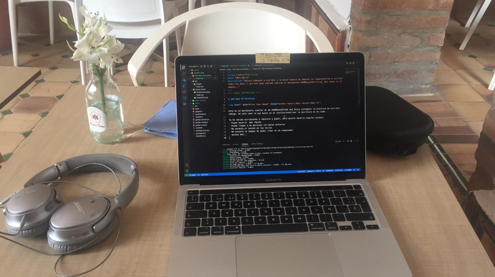
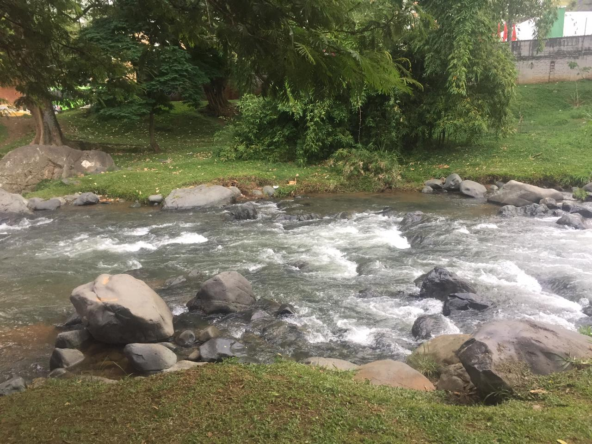

<!-- date: año-mes-día -->

# 100 Days Of Writting

Hoy escribo desde aquí:

Este es un movimiento similar al de #100DaysOfCode qué busca contagiar la practica de escribir código. En este caso lo que busco yo es institucionalizar la escritura en mi vida.

Ya he venido escribiendo a lapicero y papel, pero quiero hacerlo digital porque:
- Puedo hacerlo  más rápido
- Puedo llegar a ás personas con menos esfuerzo
- Me encanta el sonido de las teclas 
- Me encanta la imagen de poder crear en un computador
- muchas más...

Lo importante en todas las ocaciones es creeer y crear. La heramientas o el medio que encuentres sigue siendo importante pero por la esencia del ser humano esta en segúndo plano.

No siendo más hoy se da la apertura oficial a este iniciativa en mi camino como escritor. 

Nota: Hoy es sábado y en mí ritual mañanero puedo caminar más tiempo, entonces decidi ir al rio para escucharlo, sentir el viento y descalzarme para seguir siendo feliz.

