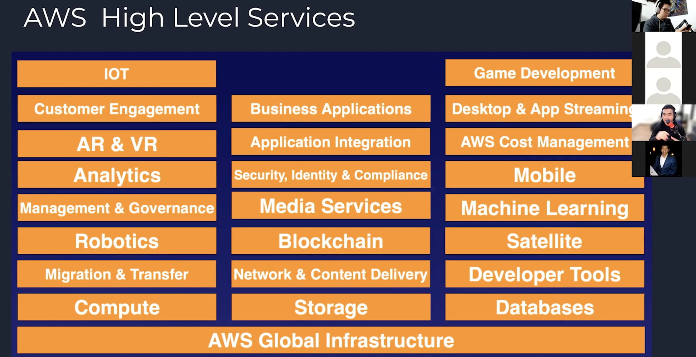

<!-- date: año-mes-día -->

 Links

<ul>
  <li>
    <a href="https://aws.amazon.com/certification/?trk=ps_a134p000006gXRtAAM&trkCampaign=GLBL-FY21-TrainCert-Certification_PaidSearch&sc_channel=PS&sc_campaign=FY21-TrainCert-Certification_PaidSearch&sc_publisher=Google&sc_category=Training%20and%20Certification&sc_country=LATAM&sc_geo=LATAM&sc_outcome=acq&sc_detail=aws%20certification%20cost&sc_content=General_exact&sc_matchtype=e&sc_segment=544685383802&sc_medium=TC-P|PS-GO|Brand|Desktop|AW|Training%20and%20Certification|Certification|LATAM|EN|Text|xx|B2I&s_kwcid=AL!4422!3!544685383802!e!!g!!aws%20certification%20cost&ef_id=CjwKCAjwyvaJBhBpEiwA8d38vD1UGKfx6ry9lnf27J4EE2P8ADV1_JlMizYGOY0-Y0LHsn8y9yJGwBoCYaUQAvD_BwE:G:s&s_kwcid=AL!4422!3!544685383802!e!!g!!aws%20certification%20cost" target="_blank">AWS Certtification cost</a>
  </li>
  <li>
    <a href="https://docs.aws.amazon.com/cli/latest/userguide/install-cliv2.html" target="_blank">Inatalacion de AWS Cli</a>
  </li>
</ul>

## ¿Qué es el _Cloud Computing_?

Son la demanda de servicios:
- De computo
- Bases de datos
- Almacenamientos
- Aplicaciones
- Otros recursos de tecnología...
Bajo el modelo de negocio **_pay-as-you-go-pricing_ / Pada lo que utilices**

## Las 6 ventajas del _Cloud Computing_

1. _Trade Capital Expense For Variable Expense:_ Pagas solamente lo que utilizas
2. _Benefit from massive econommice of scale:_ A mayor personas usando los servicios Menos los precios a pagar por los servicios
3. _Stop guessing about capacity:_ Certeza de cuanto consumes en cada servicio
4. _Increase speed and agility:_ 
5. _Stop spending money running and maintianing data enters:_ Apalancarse en expertos del tema para qué te foques en el _core_ del negocio
6. _Go global in minutes:_ Con simples click podemos desplegar nuestra App en varios zonas del muno, generando una baja latencia.

## Las 3 tipos de _Cloud Cumpiting_

1. _Infraestructure As A Services - IAAS_
Lo que hace AWS, Azure, GCP, etc empresas que provee servidores físicos o virtuales como si fuera un sistema operativo, tu no tienes acceso al servidos pero si lo puedes usar.

2. _Platform As A Service - PAAS_
Es donde alquien más maneja la capa de hardware y el sistema operativo y tu te enfocas en ls Applicaciones que realizas. Solo te preocupas del despliegue de tu app, no te preocupas de las actulizaciones ni temas de seguridad. Heroku.

3. _Sofware As A Service - SAAS_
Simplemente como Gmail, Platzi, Uber, ets. Tu solo manejas los servicios y la empresa se encarga de todo lo demás.

Foto final de la sesión :)

