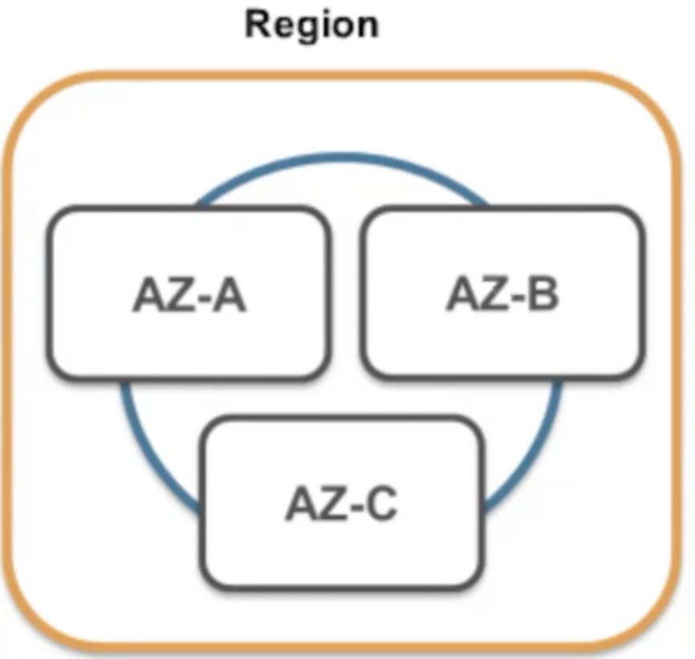

<!-- date: año-mes-día -->

 Links

<ul>
  <li>
    <a href="https://aws.amazon.com/es/about-aws/global-infrastructure/" target="_blank">Infraestructura global de AWS</a>
  </li>
  <li>
    <a href="https://www.cloudping.info" target="_blank">Ver la latencia de cada servicios de AWS</a>
  </li>
</ul>

Tips para el examen

<ul>
  <li>¿Cómo decido en qué Región pongo mi App? Por la latencia hacia mis usuarios, AWS Services, 
leyes de soberanía de datos / Data sovereignty laws (Si un dato puede o no salir de un país) </li>
  <li>Entender la diferencia entre: Una Región, una Availability Zones (AZ) y una Edge Location</li>
  <li>Entender la diferencia entre los diferentes paquetes de soporte: Basic free, Developer $29/month, Businees $100/Month, Enterprise $15000/month - Technical Account Manager (TAM) Min:27</li>
  <li>Billing Alarms</li>
</ul>

### ¿Qué conocimientos necesito para pasar el examen?
Para pasar el examen necesito conocimiento cobre:
- Compute
  - EC2
  - Lambda
- Data base
  - Relational DB Service (RDS)
  - DynamoDB (Non Relational DB)
- Storage
  - Simple storage Service
  - Glacier
- Network 
 - VPC
 - Route53

-----

### ¿Qué es una Región? 
- Una región es una área geografíca
- Cada región consiste en dos o más ***Availability Zones (AZ)***/**Zonas de disponibilidad**
### ¿Qué es una _Availability Zones (AZ)_/Zonas de disponibilidad? 
- Una Zona de Disponibilidad es una ***Data Center***
- Un ***Data Center*** con varios edificios cercanos, sigue siendo un solo ***Data Center***
- La seguridad de un ***Data Center*** es responsabilidad el proveedor de la nube (Capa de responsabilidad social)

### ¿Qué es una _Edge location_?

- Un _Edge location_ es un _End Point_ de AWS qué se usa para chactchar contenido. Consiste en _CloudFront_ y es el _Content delivery Network (CDN)_.
- Un _Edge location_ se usa para distribuir contenido rapidametne y generar una mejor experiencia de usuario, ya que, deja huellas de datos cercanas a la ubicación del usaurio.
- Todo archivo de tipo estático

### Los 3 tipos de despliegues de _Cloud Computing_
1. Public Cloud: AWS, AZURE, GCP
2. Hybrid: Unión entre lo público y lo privado
3. Private Cloud (On Premise)

### ¿Para qué sirven las Alarmas?

Sirve para ver cuanto dinero nos estamos gastando usando los servicios

### ¿Cómo se configuran las Alarmas?

