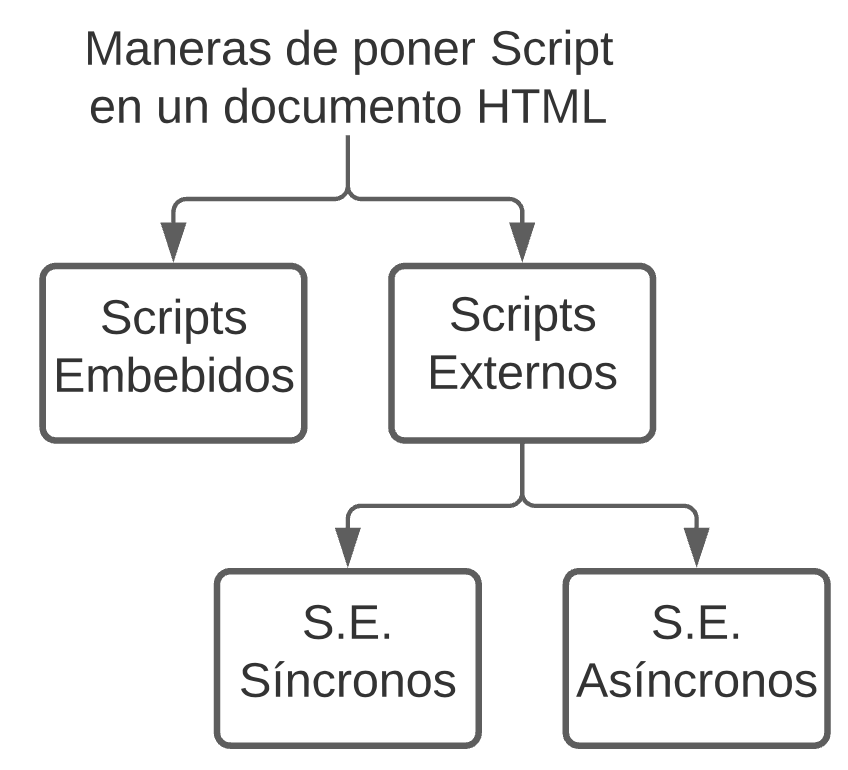

<!-- date: año-mes-día -->

## ¿Cómo llega un script al navegador?

Para entender como llega un Script al navegador comencemos a hablar sobre el **Document Object Model - DOM**
El **DOM** es la representación que hace el navegador de un documento HTML.
El navegador interpreta el archivo HTML y cuando termina de transformarlo al DOM se dispara el evento **DOMContentLoaded** lo que significa que todo el documento está disponible para ser manipulado.
Todo script que carguemos en nuestra página tiene:
- Un llamado (tiempo)
- Una ejecución (tiempo)

Los Script pueden ponerse en el documento HTML de dos formas: Los script Embebidos y los script externos, estos últimos pueden ser de manera sincrona y asincrona.

### Scrips Embebidos
### Scrips Externos
### Scrips Externos Síncronos
### Scrips Externos Asíncronos