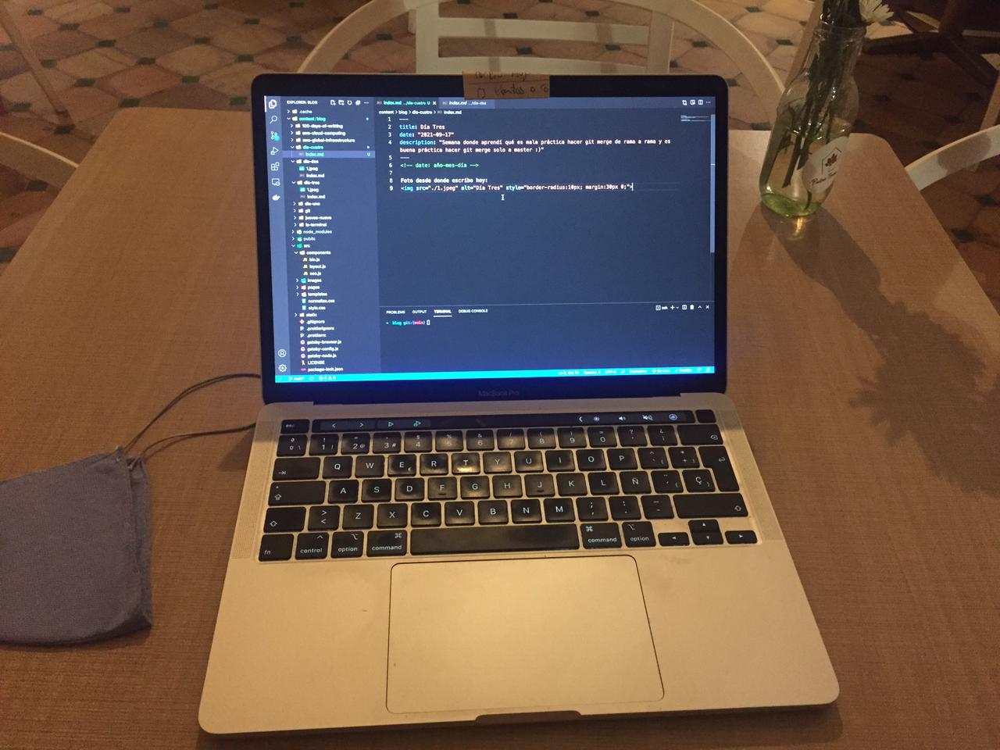

<!-- date: año-mes-día -->

Desde aquí escribo hoy: 

Se finalizo la semana con una hermosa tarde color violeta, lila, purpura y morado claro. La luna brilla fuerte dede ayer y esta creciendo al igual que mi desempeño en el cñodigo decifrando logica en lenguajes que no he aprendido y de mentes de otras personas. 

En este monento siento cansancio en los ojo, pero mi mente esta lucida, despierta y atenta para seguir absornviendo pistas y datos para ser mejor desarrollador. De hecho estoy estudiando JavaScript en freeCodeCamp cuando decidi tomarme una pausa para escribir mis letras de hoy.

Siento qué voy aprendiendo rápido y eso me encanta. También estoy disfrutando el proceso, cad tensión, cada error, cada aprendizaje, cada pista, cada caracter y cada lógica entendida... muchas gracias vida por esta vida.

Me siento muy afortunado de ser el primero de mi clan en estar escribiendo código, ya qué la interpreto cómo escribir un libro, hacer una obra plástica o tocar piano.

Cada vez qué me siento en el pc, siento qué estoy haciendo algo grande, qué estoy contribuyendo al mundo, impactando globalmente y sobre todo siendo ejemplo de acción de mis dos creencias anclas: La ontología del lenguaje y la conolización de los bit.

Cada día incremento la inercía de mi energía :) Me siento satisfecho de mi camino, de mis decisiones y de mis accione diarias. 

Feliz vida! 
