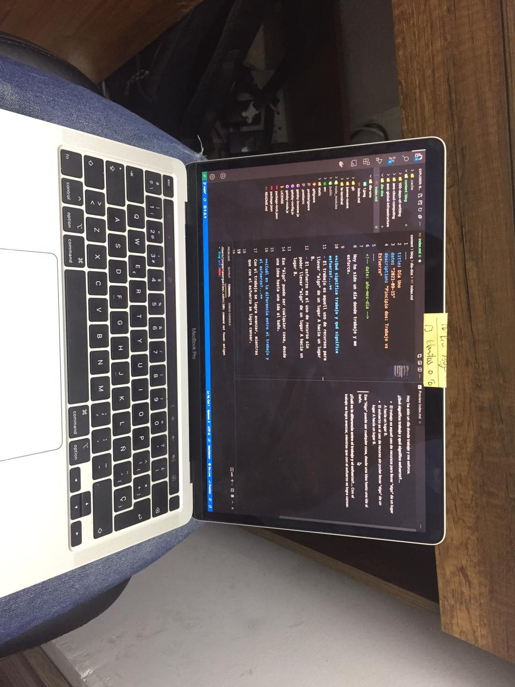

<!-- date: año-mes-día -->

Foto desde donde escribo hoy:

Hoy ha sido un día donde trabaje y me esforce.

**¿Qué significa trabajo y qué significa esfuerzo?...**

- El trabajo es aquell uso de recursos para llevar "algo" de un lugar A hacia un lugar B.
- El esfuerzo es el uso de recurso sin poder llevar "algo" de un lugar A hacia un lugar B.

Ese "Algo" puede ser cualquier cosa, desde una idea hasta una ida al baño.

**¿Cuál es la diferencia entre el trabajo y el esfuerzo?...**
Con el trabajo se logra avanzar, mientras que con el esfuerzo se logra cansar.
