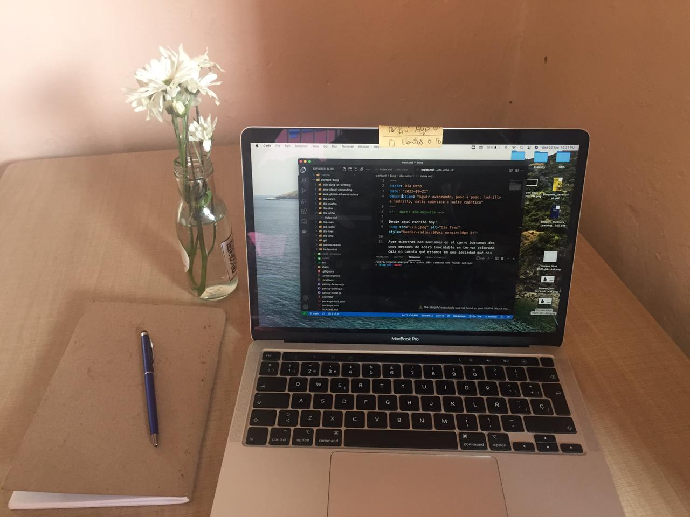

<!-- date: año-mes-día -->

Desde aquí escribo hoy:

Hoy es un día especial porque amaneci con los parpados hinchados :) osea que soy alergico algo jaja
Llevo dos días tomando una pasta y hechandome unos quimicos por las fozas nazales para desinflamar los cornetes porque los tengo muy inchados y me inpiden respira.

Mi hipotesis es que los quimicos que me aplico en la nariz fueron los causantes de la reación quimica de mi rostro.

Además amanecio lloviendo y me desperte con el sonido de la alarma...decidi no salir a caminar para evitar incrementar la molestias respiratorias.

Por otro lado ya es mitad de semana y andamos recibiendo requerimientos del Sprint 9, en e cuál, aportare en dos proyectos hasta ek momento. Esperemos el pasar de los días ...

Voy a añadir una pregunta diaria para registarr mis aprendizajes. Todos los días aprendemos algo nuevo, solo qué aveces no lo interpretamos cómo valioso o simplemente ponemos la atención en otras cosas...la intención con esta iniciativa es relativizar la vida, estar presente, valorar el camino, agradecer, destilar lo "bueno" de todo, ser humano.

---

## ¿Qué aprendí hoy?

- Aprendí qué soy alerjico a un medicamenteo nazal
- Aprendí qué una función recurrente es quella que se llama así misma.
  - Requeiren dos casos:
    1. El caso base qué indica cuando para la auto llamada a la función
    2. El caso recurrente qué es la auto llamada de la función en si misma con index n-1 o n+1 según sea el caso
-
