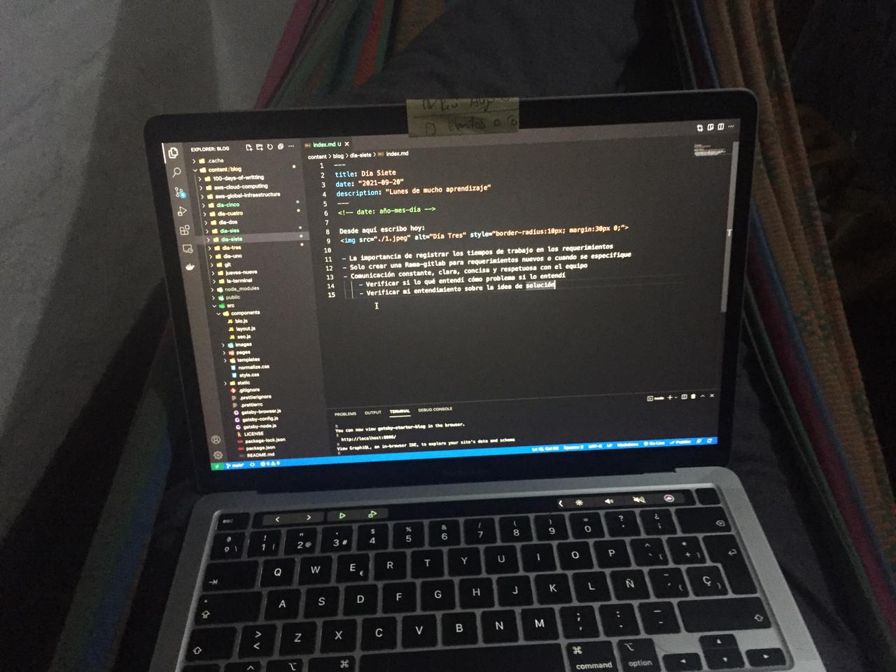

<!-- date: año-mes-día -->

Desde aquí escribo hoy:

- La importancia de registrar los tiempos de trabajo en los requerimientos
- Solo crear una Rama-gitlab para requerimientos nuevos o cuando se especifique
- Comunicación constante, clara, concisa y respetuosa con el equipo
  - Verificar si lo qué entendí cómo problema si lo entendí
  - Verificar mi entendimiento sobre la idea de solución
