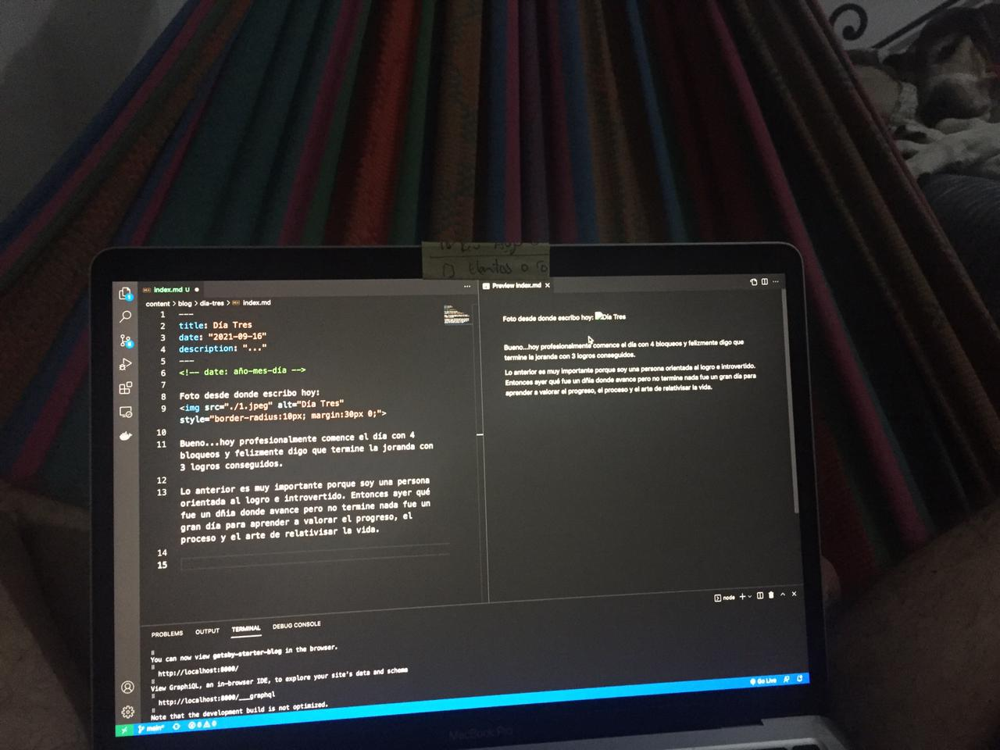

<!-- date: año-mes-día -->

Foto desde donde escribo hoy: 

Bueno...hoy profesionalmente comence el día con 4 bloqueos y felizmente digo que termine la joranda con 3 logros conseguidos.

Lo anterior es muy importante porque soy una persona orientada al logro e introvertido. Entonces ayer qué fue un dñia donde avance pero no termine nada fue un gran día para aprender a valorar el progreso, el proceso y el arte de relativisar la vida. 

Ayer me di cuenta que me gusta más estudiar un lenguaje de programación que ingles. Creo que puede ser porque domino más el lenguaje de programación que el Ingles...

Fin del comunicado...me voy a estudiar JavaScript :)