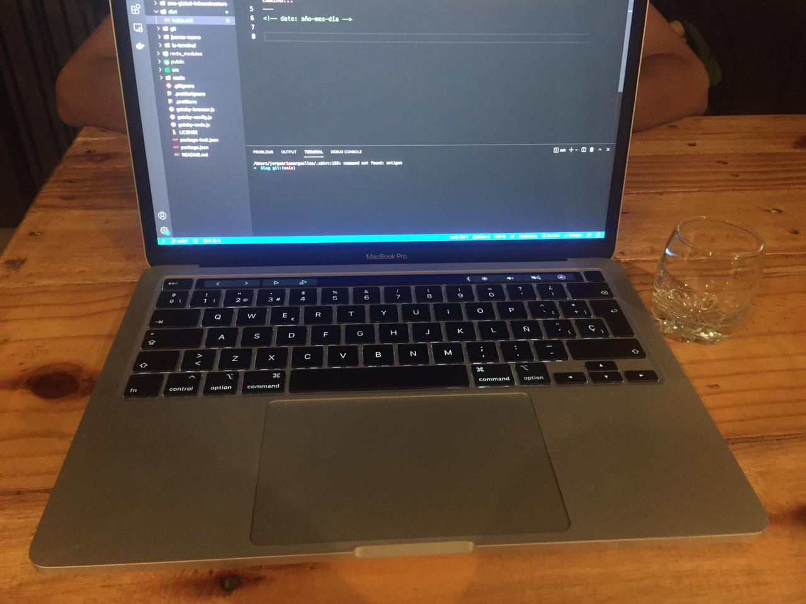

<!-- date: año-mes-día -->

Foto desde donde escribo hoy: 

Día uno de #100DaysOfWritting.
Para qué algo sea sostenible en el tiempo debe cumplir dos condiciones:
1. Qué requera el menor trabajo posible
2. Qué sea divertido
3. Qué se haga todos los días 

Por eso escribir lo primero que se me venga a la mente, en cualquier momento del día, es el método qué estoy aplicando para generar la libertad suficiente para qué mientras estoy avanzando en mi proceso cómo escritor, me divierta y haga el menor trabajo posible. 

Triangulo virtuoso de la inercia.