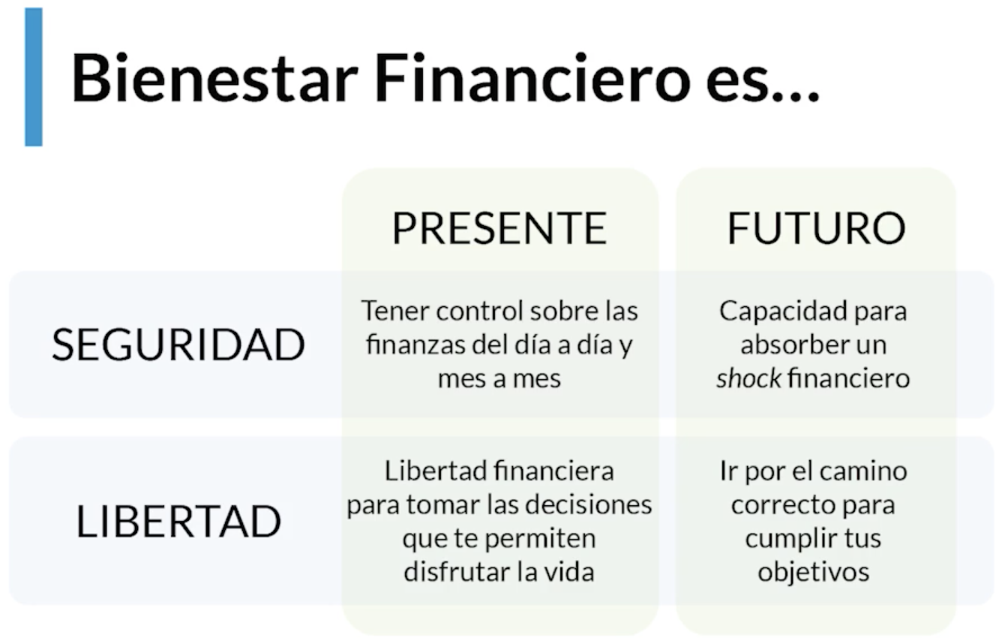
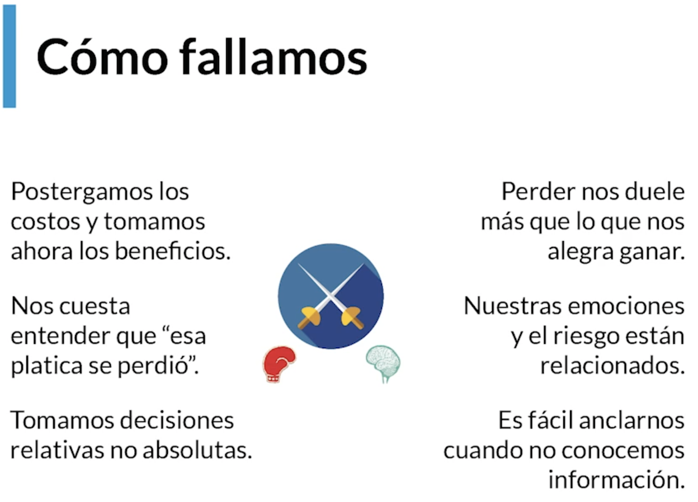
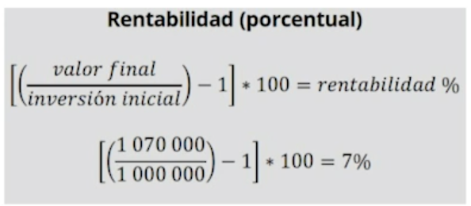
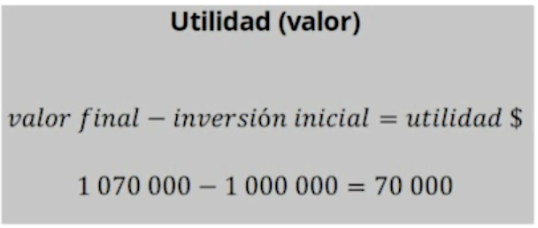

<!-- date: año-mes-día -->

[www.figuro.li](https://figuro.la)
# 1. ¿What is Personal finance & where we can start?

## 1.1 ¿When and how we make financial decisions?
Everyone every days is making financial decisions, like this:
- Consumption
- Saving
- Investment
- Risk management
- Indebtedness

## 1.2 ¿What are we talking about when we say personal finance and financial education?
> "personal finances are more personal than financial" Tim Maurer.

When we say personal finance and financial education we speak about **financial well-being**

## 1.3 Why We Fail In Our Personal Finances: The Role Of Inertia
> Homework: Do timeline of a year focusing in outcome no monthly, for example, birthdays, black friday, etc. 

## 1.5 Understanding how you decide based on your financial education

## 1.6 Basic concepts that are important to understand before you start making good financial decisions

- **Opportunity cost:** It will be the best option that we reject for using our resources where we decide. (The second better than...). It is useful to understand our spending or investment decisions that we make
- **Income distribution:** It will be the allocation we make to our money. It can be spending, saving or investing and we measure it in percentage %.
- **Shortage:**  The shortage is not a relationship about a limited resource. The shortage raise from the relationship between our needs and the availability of the resource.
- **Offer & Demand:** 
  - Offer is what producers can offer
  - Demand is what people buy
  - If demand growth but the offer can't growth at the same ratio, so, the prices UP!
  - If Offer growth but the demand don't growth, so, the prices DOWN.
- **Profitability and Utility:** 
  - Profitability is calculated in %

  - Utility is calculated value (COP, USD, EUR)

- **Risk:** Is the probability we have to the result will be different from what we plan.

- **Interest rate:** A good practice is alway work with effective rate.
- **Cash flow and liquidity:** Cash flow means the cash movement -> how many and when: income & outcome.
- **Debts & expenses:**
  - debts is money borrowed to us
  - Expenses is a payment that we choice to do to receive a service or product.

# 2. Assess our personal financial situation

:)

# 3. ¿How to create our own Financial Plan?
# 4. Strategies to comply with our Financial Plan