<!-- date: año-mes-día -->

Desde aquí escribo hoy:
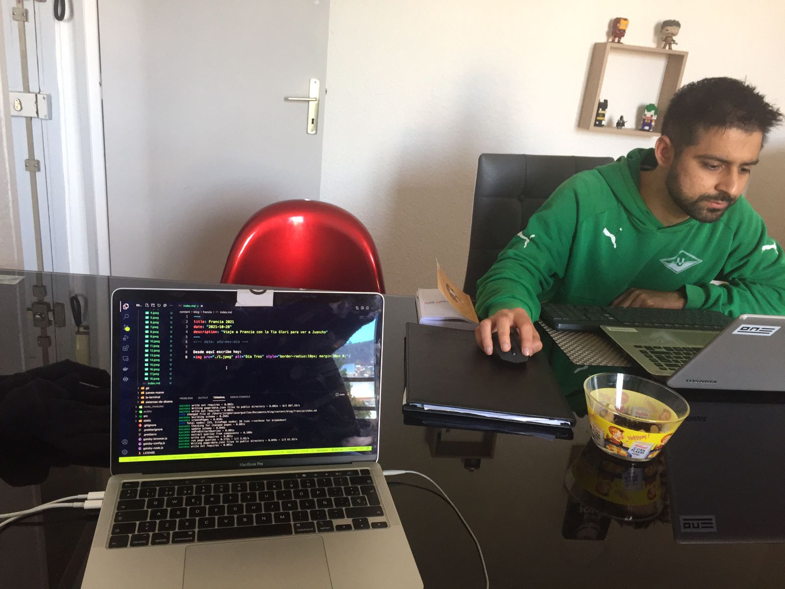
Mi primo Juancho trabajando :)

---

Foto en el avion hacia Paris
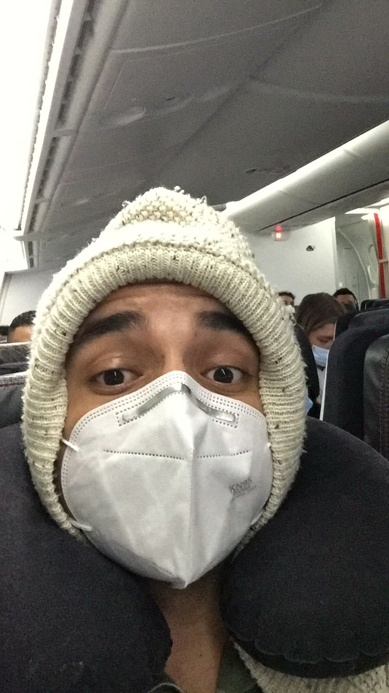

Foto siendo sexy en el baño del aeropueto de Paris
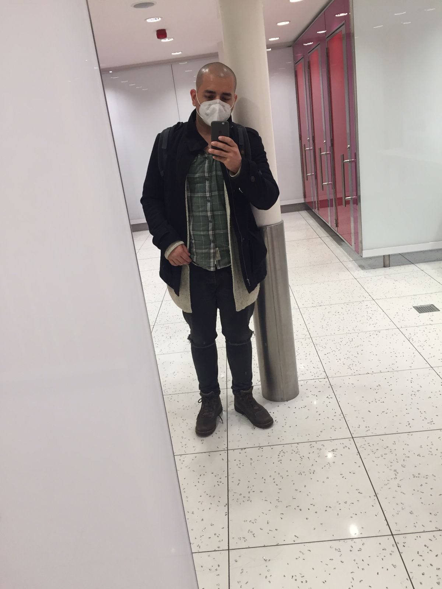

Buenos días hermosa!
Te amo y te extraño si ha pasado dos años y con todo el tragin de movernos de un lado a otro sin internet ni el idioma ha sido desafiante.

** Te amo 😍 \***

La ruta para llegar donde Claire esa coger metro hasta un punto, salir de la estación y buscar una parada de bus...esa salida del metro fue de pelicula...porque literal era bajar unas gradas y abajo habia barriles con fuego, gente vendiendo mazorcas y carne asada en la calle y mucha gente con sacos y capuchas ...tipo peliculas de _newyork y homeless_... afortunadamente dos chicas afros que le preguntamos, una se salio dela estación para guiarnos hasta el paradero de bus...al parecer si era peligroso jajajaj Claire me recomendo decirla ala tia que guardara las joyas, eso icimos. la tía anda desconectada de la realidad, tanto que en la familia hemos hablado de la dínamica de Ana rosa y lo dificil que es ella... la tía ahora comparte esa misma dinámica y es dificil.

Cogimos ese bus qué al parecer no pagamos gracias a no tener red ni interned...porque se pagaba con un sms qué nunca salio...

En ese bus, a dos parada de la nuestra se subio un chico que sorpresivamente se encontro con otro que se habia subido en nuestra parada.... no quise ver toda la escena pero creo que ellos hicieron una transacción droga<->$ ...

Luego nos bajamos en el Hospital que era nuestra parada.... ellos dos también bajaron jajaja... yo mirando al rededor para que no fuese a pasar algo extraño (mentalidad latina paranoica con delirio de persecución y adrenalina de estar en un lugar nuevo, de noche sin internet ni háblar el idioma)

Lo primero que vimos fue una esquina con un local donde venden pollo asado atendido por perosnas de India, fue muy loco pedir ayuda porque hay reostros con todas lasfacciones del mundo, según mis estandares de belleza y personalidad...las facciones fuertes son personas serías, burdas y malas personas... todos eran buena gente, casi que les haciamos sentir falicidad cuando le pediamos ayuda y niosotros entendiamos el mensage de ayuda. Nos daban buena energía y con una sonriza, en ingles, frances o indie nos despidieron despues de aclarar hacia onde teniamos que caminar para encontrar la casa de Claire.

Dos cuadras, girar a la izquierda y llegamos... luego caí en cuenta que no teniamos como indicarle que habiamos llegado... eso de fluir con la vida he ir resolviendo en el camino lo he aprendido jajajaj otros diran qué ya no planeo ni prevengo...jajjaja

Paso un señor con facciones fuertes fumando cigarrillo como las peliculas, de los hombres malos de pelis... la tia lo paro y le repgunto algo en español caleñisimo y el manda solo decía algo frances con Madam jajajaj yo intuyí que no le entiendia entonces me acerque para mostrarle la dirección de Claire... él maln que tenia padres de Argelia y Francia nos metio a otra unidad mientras averiguaba las indicaciones, yo pensando es´ten man nos va a emboscar jajajajajjajajajajaja

Luego del momento de tensión que solo yo tuve jajaja él hombre confirmo que estabamos bien desde un inicio, y luego le pedi un minuto para llamar a Claire para indicarle que habiamos llegado... Clair bajo y luego hablando con el chico qué poco hablaba ingles y español.... entendio que ya todo ok y se retiro, creo que se interpreto algo rudo de mi parte, me sentí mal con la imagen porque no era la intención... pero fue lo que paso. La importancia de la comunciación más alla del idioma.

** Te amo 😍 \***

Claire nos recogio... vive en unas unidades súper bellas y su apto es perfecto, es una chimba!!!! Domirmos súper bien, como tiene un balcon una chimba fuma afuear.... la casa esta brutal!

Foto con Claire :)
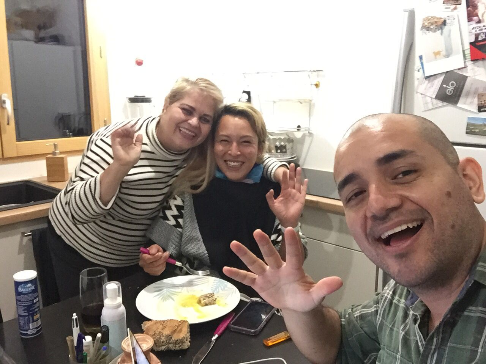

Al día siguiente me levante a las 9am y la tía a las 10am igual que claire, salimos a comprar un pan y tomar cafe horrible en uan esquina... comi un Pan au Chocolat :) , luego dimos una vuelta por la ciudad de clair, fuimos hasta el centro de la ciudad donde esta ela yuntamiento, la iglecia central y un lugar de trabajo social qué nose si es donde Claire iba a hacer voluntariado o iba a terapias grupales (Debido al intento de robo de hace meses)
Todo es hermoso, es direfertente, lo aprecio con mayor facilidad y mayor gusto que antes, quizas porque ya tengo un refente... :)

Tambien fuimos a las Cities que son esas unidades que en las peliculas las muestran como "barrios bajos" y Claire nos mostros un mural donde estaban los precios de cada droga que puedes conseguir en esa cities, nos contaba que es un punto de mucho trafico de drogas de paris... crack, coca y otras se conseguian...

Mientras caminaba la ciudad de Claire dije que es una chimba vivir por fuera de Colombia un tiempo, donde se pueda experimentar las 4 estaciones contigo. ❤️ 😍...

La experiencia de por sí es muy enriquecedora, pero yo quiero contigo para que sea mejor, para que sea llenita de amor y de compañía, para que sea familiar, para poder perder el tiempo juntos, tomar un café o simplemente leer en el atardecer, caminar y sentir el aire frío.

**\* Te amo 😍 **

Fotos de la vista del valcon de Claire
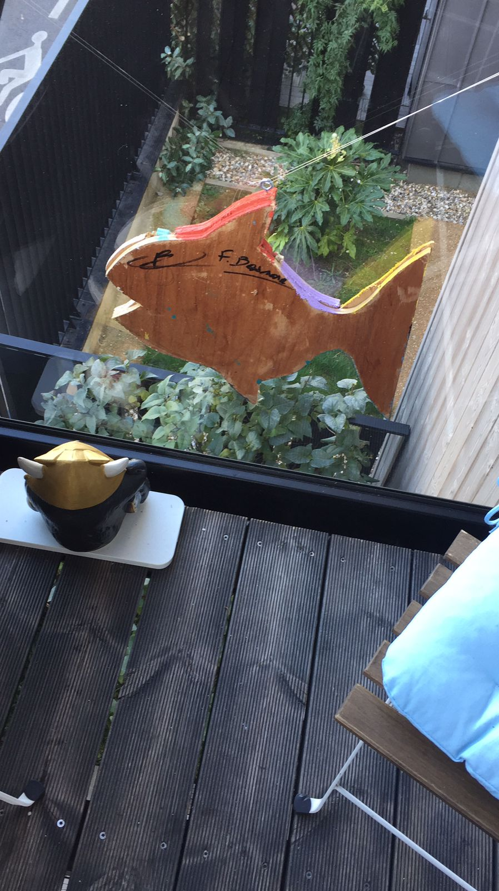
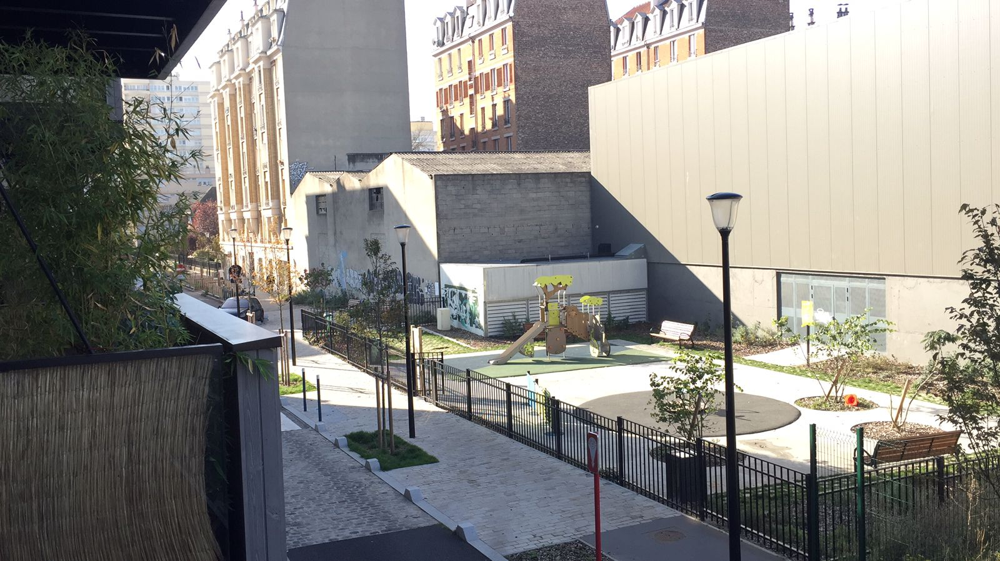
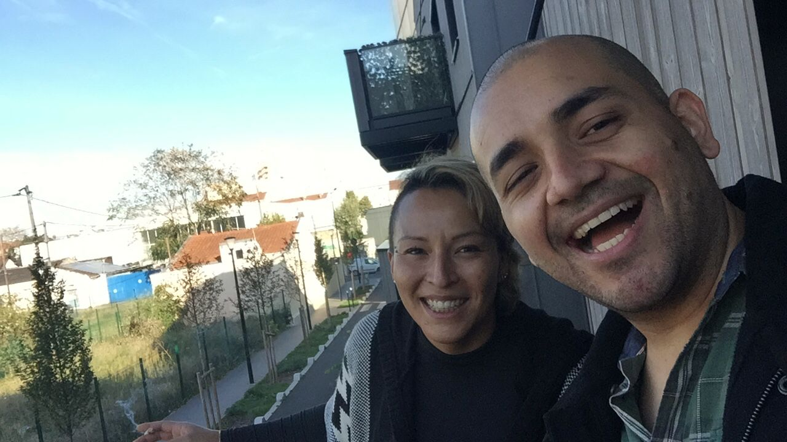
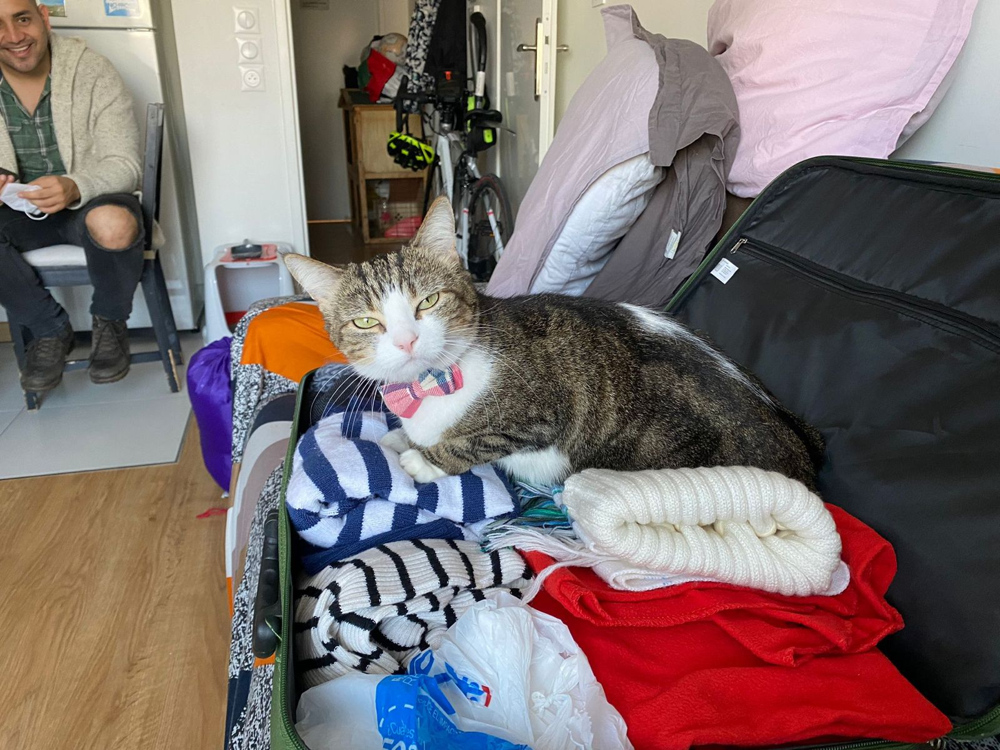
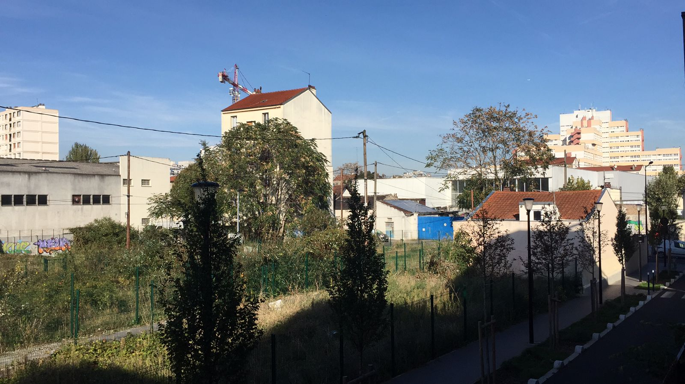
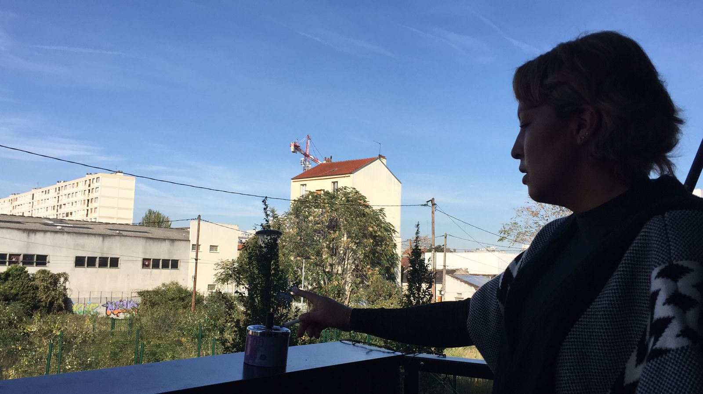

Luego regresamos a coger las maletas y ahí si caminanos despacio, sin afán porque teniamos casi 4 horas de ventaja. A las 12:30 que fue la hora de nestra salida, la ruta era coger el metro la ruta 7 hasta Pyramids y luego la ruta 14 hasta el parque...cuando salimos de la estación llegamos a un lugar super bonito lleno de trezzas de comida de varias partes del mundo y como estamos en Octubre habian eventos familiares para niño por el tema de las brujitsas...entonces muchas muchas personas caminando en familia o simplemnte almorzan...fue muy lindo con el sol pleno... nos sentamos en la mitad del corredor a descansar por 40 min, yo ley un poco y tomaba el sol mientras la tia miraba todo al rededor...

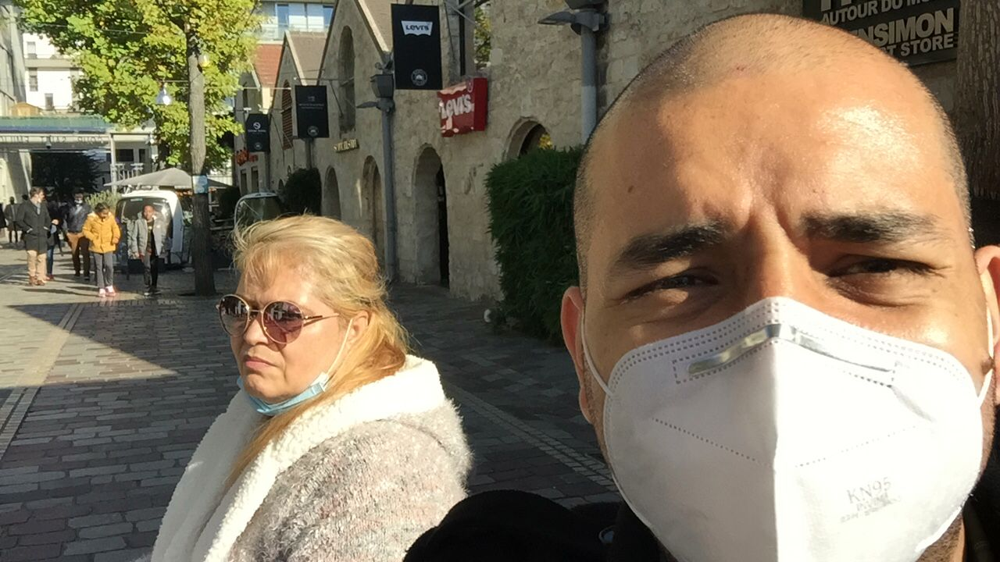
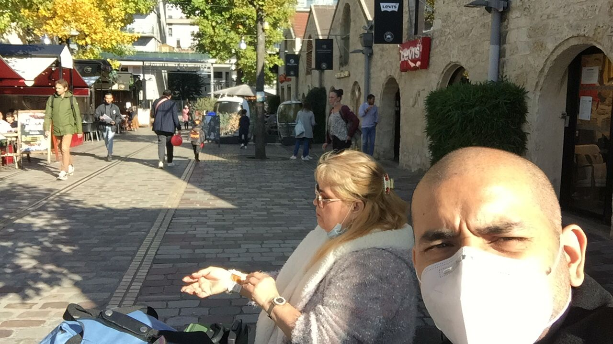

Al abordar el bus nos tomó por sorpresa que nos pedían prueba covid jajaja menos mal teníamos impresas las pruebas de sura aún, mostramos esas y nos dejaron abordar... dormimos en el trayecto. Casi 7 horas despues llegamos a destinodonde Juancho con un amigo frances (Alex, que se recorrio en bici desde cartagena hasta cordoba argentina el ao pasado). Ahí la tía lloro porque no penso volver a ver a juancho ... les dimos su espacio.

Alex él amigo frances de juancho, es pareja de Suana la chica Colombia, amiga del Master de juancho que estuvo super atenta con todo lo que paso juancho. Susana y Paula (la novia) eran el puente de comunicaci´ñon mientras todo pasaba...

Llegamos al apto de juancho donde vive con theo un chico frances de 23 años. Viven fente a la plnata central de Michelin ...tiene un parqueadero muy lindo.

cenamos pasta con bolognesa y aceitunas y tres tipos de queso y pan frances...muy muy muy rico! :)
Amo los quesos, las aceitunas y el vino gracias a tí :)
** Te amo 😍 **

Cenamos Juancho, la tía, Alex...Susana y Theo nos acompañaron porque ya venian de otros compromisos... fue muy chevere, muy lindo el hogar y el compartir. Posiblemente hacemos lechona de la abuela :)

Foto del atardecer camino donde Juancho
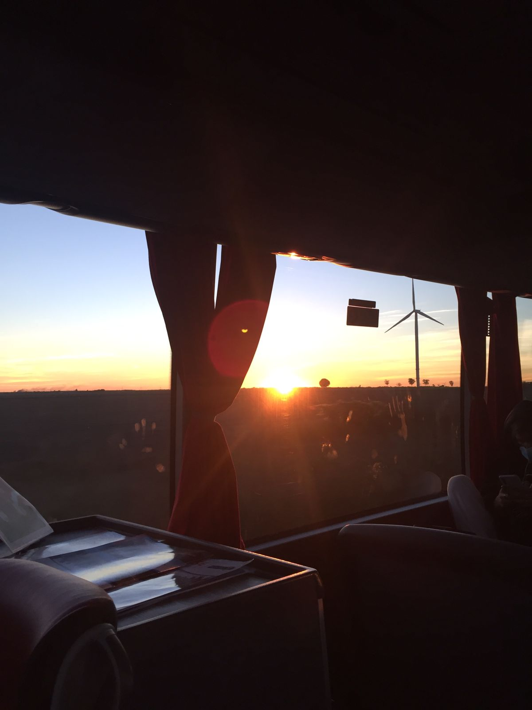

Foto con Juancho :)
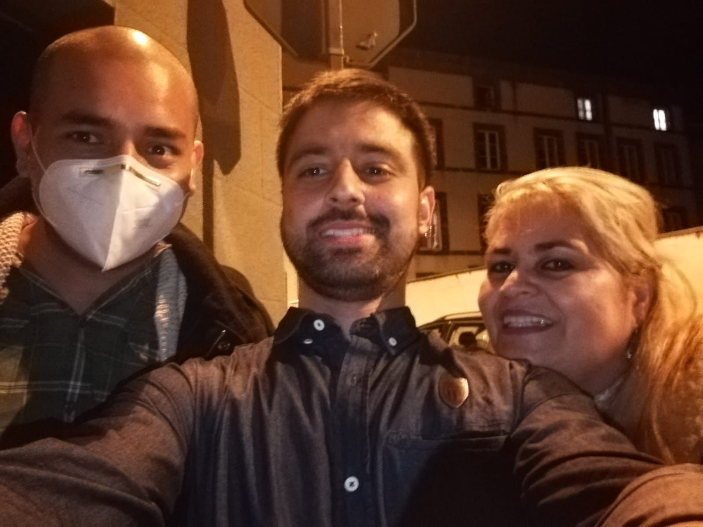
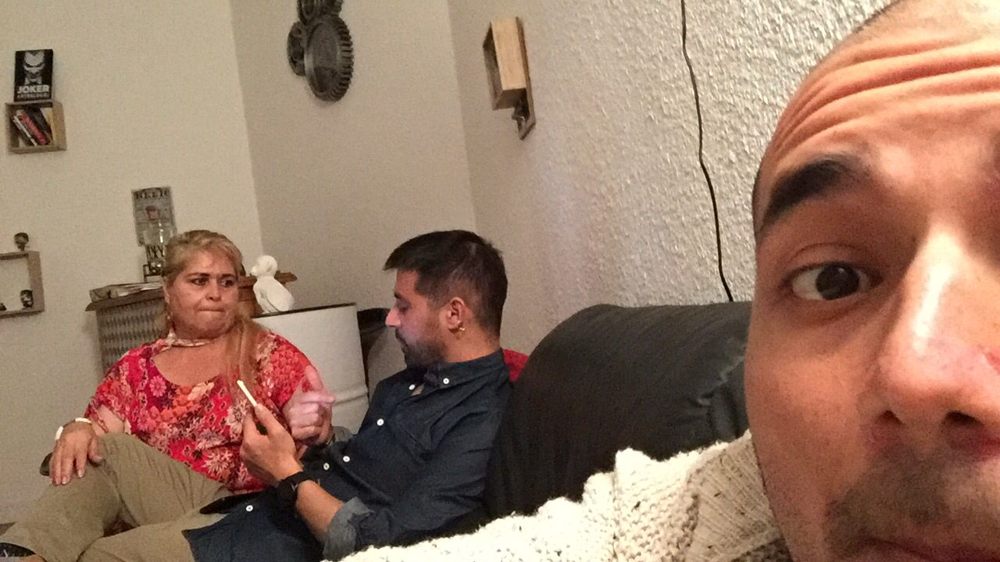
