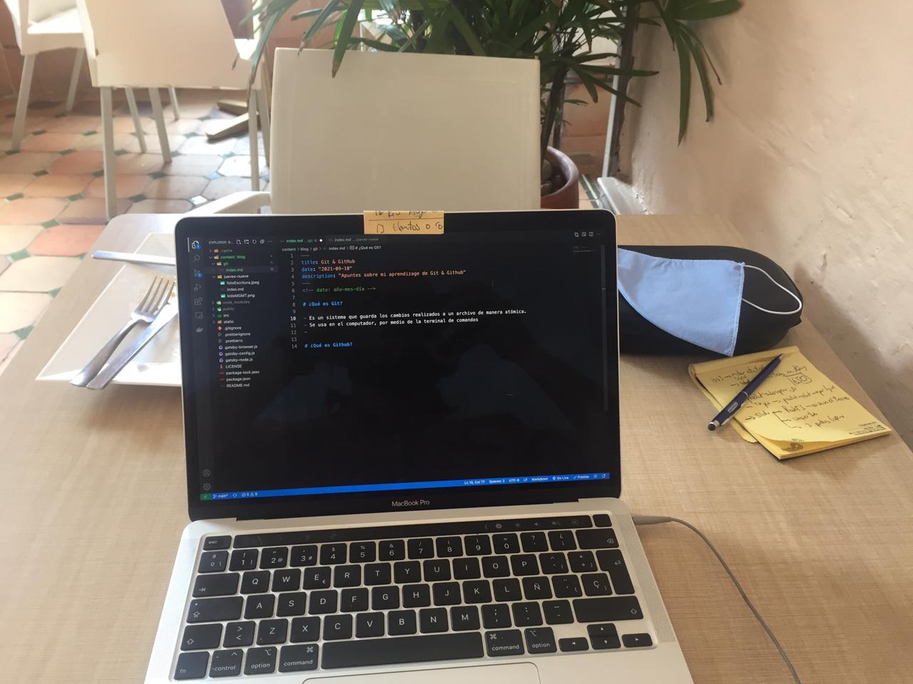
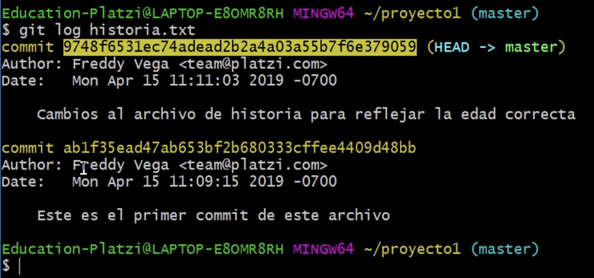
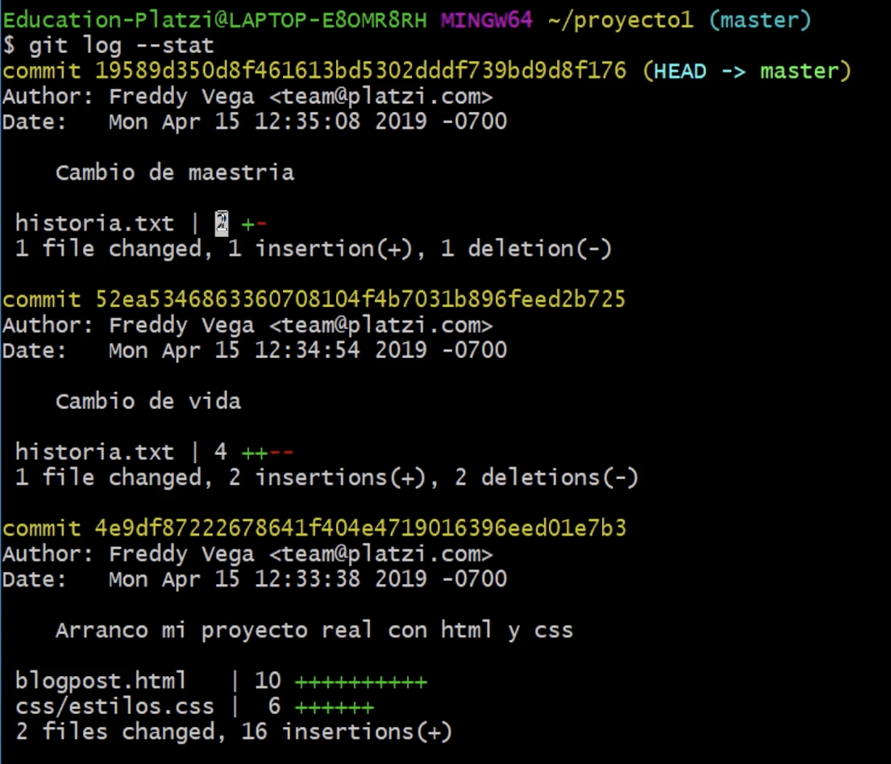

<!-- date: año-mes-día -->

### ¿Qué es Git?

- Es un sistema que guarda los cambios realizados a un archivo de manera atómica.
- Se usa en el computador, por medio de la terminal de comandos.

#### Configuración de Git

- **git init:** Comando para crear un repositorio local, es una carpeta oculta nombrada **_.git_**
- **git config:** Comando para ver todas las configuraciones en el momento
- **git config --list:** Comando para ver una lista de configuraciones por defecto
- **git config --list --show-origin:** Comando para ver donde están las configuraciones guardadas
- **git config --global user.name "tu nombre":** Comando para editar la configuracion del usuario de Git
- **git config --global user.email "tu email":** Comando para editar la configuracion del email de usuario de Git
#### Comandos básicos de Git
- **git status:** Comando para ver el estado del proyecto en ese instante.
  - Muestra la rama en la que estamos
  - Muestra si hay o no _commits_
  - Muestra archivos modificados qué no estamos rastreando / untraked
- **git commit am "Mensaje descriptibo del commit:"** Básicamente, **_git add y git commit_** al mismo tiempo. Solo funciona con archivos donde ya he trabajado y previamente he realizado un **_git add y git commit._**
- **git add:** Comando qué añade un archivo y sus cambios en el **_staging_** para poder ser rastreados y posteriromente enviados al repositorio remoto.
  - **git add nombre_del_archivo** añade solo el archivo qué le indiquemos
  - **git add .** añade todos los archivos que hemos odificado
- **git rm:** Comando para eliminar archivos de Git sin eliminar su historial del sistema de versiones. Recuerda que git rm no puede usarse así nomás. Debemos usar uno de los flags para indicarle a Git cómo eliminar los archivos que ya no necesitamos en la última versión del proyecto:
  - **git rm --cached:** Elimina los archivos de nuestro repositorio local y del área de staging, pero los mantiene en nuestro disco duro. Básicamente le dice a Git que deje de trackear el historial de cambios de estos archivos, por lo que pasaran a un estado untracked.
  - **git rm --force**: Elimina los archivos de Git y del disco duro. Git siempre guarda todo, por lo que podemos acceder al registro de la existencia de los archivos, de modo que podremos recuperarlos si es necesario (pero debemos usar comandos más avanzados).
- **git commit -m "mensaje sobre lo que contiene del commit":** Comando para enviar archivos desde el **_Staging Area_** hacia el **Repositorio Remoto**
- **git log:** Comando para ver la historia de los cambios de un archivo
    
    - **git log -stats:** Comando para ver los cambios especificos que se hicieron y en cuales archivos se realizaron.
    
    
    - **git log --oneline:** Te muestra el id commit y el título del commit.
    - **git log --decorate:** Te muestra donde se encuentra el head point en el log.
    - **git log --stat:** Explica el número de líneas que se cambiaron brevemente.
    - **git log -p:** Explica el número de líneas que se cambiaron y te muestra que se cambió en el contenido.
    - **git shortlog:** Indica que commits ha realizado un usuario, mostrando el usuario y el titulo de sus commits.
    - **git log --graph --oneline --decorate y git log --pretty=format:"%cn hizo un commit %h el dia %cd":** Muestra mensajes personalizados de los commits.
    - **git log -3:** Limitamos el número de commits.
    - **git log --after=“2018-1-2”** 
    - **git log --after=“today”**
    - **git log --after=“2018-1-2” --before=“today”:** Commits para localizar por fechas.
    - **git log --author=“Name Author”:** Commits realizados por autor que cumplan exactamente con el nombre.
    - **git log --grep=“INVIE”:** Busca los commits que cumplan tal cual está escrito entre las comillas.
    - **git log --grep=“INVIE” –i:** Busca los commits que cumplan sin importar mayúsculas o minúsculas.
    - **git log – index.html:** Busca los commits en un archivo en específico.
    - **git log -S “Por contenido”:** Buscar los commits con el contenido dentro del archivo.
    - **git log > log.txt:** guardar los logs en un archivo txt

#### Analizar cambios en los archivos de tu proyecto con Git

- **git show nombre_archivo:** Comando para ver los cambios que ha tenido un archivo indicado
- **git diff:** Comando para ver las diferencias entre el Directorio actual vs el _Staging_ 
  - **git diff tagCommit_base tagCommit_aComparar** Comando para ver las diferencias de las versiones del archivo en momentos de tiempo diferentes

#### Volver en el tiempo en nuestro repositorio utilizando reset y checkout

- **git reset** Este comando nos ayuda a volver en el tiempo. Pero no como **_git checkout_** que nos deja ir, mirar, pasear y volver. Con **_git reset_** volvemos al pasado sin la posibilidad de volver al futuro. Borramos la historia y la debemos sobreescribir. No hay vuelta atrás.
  - **git reset tagCommit --soft:** Borramos todo el historial y los registros de Git pero guardamos los cambios que tengamos en Staging, así podemos aplicar las últimas actualizaciones a un nuevo commit.
  - **git reset tagCommit --hard:** Borra todo. Todo todito, absolutamente todo. Toda la información de los commits y del área de staging se borra del historial.
  - **git reset HEAD:** Este es el comando para sacar archivos del área de staging. No para borrarlos ni nada de eso, solo para que los últimos cambios de estos archivos no se envíen al último commit, a menos que cambiemos de opinión y los incluyamos de nuevo en staging con git add, por supuesto.
- **git checkout:** Comando para ver una versión pasada.
  - **git checkout tagCommit  nombre_archivo:** Comando para ver una versión pasada de un archivo indicado. Ahora lo puedo abrir para ver su contenido.

#### Flujo de trabajo básico con un repositorio remoto

- **git clone url_del_servidor_remoto:** Nos permite descargar los archivos de la última versión de la rama principal y todo el historial de cambios en la carpeta **_.git._**
- **git push:** Luego de hacer **_git add y git commit_** debemos ejecutar este comando para mandar los cambios al servidor remoto.
- **git pull:** Básicamente, **_git fetch y git merge_** al mismo tiempo.
  - **git fetch:** Lo usamos para traer actualizaciones del servidor remoto y guardarlas en nuestro repositorio local (en caso de que hayan, por supuesto).
  - **git merge:** También usamos el comando git merge con servidores remotos. Lo necesitamos para combinar los últimos cambios del servidor remoto y nuestro directorio de trabajo.

#### Introducción a las ramas o branches de Git

Las ramas son la forma de hacer cambios en nuestro proyecto sin afectar el flujo de trabajo de la rama principal. Esto porque queremos trabajar una parte muy específica de la aplicación o simplemente experimentar.

La cabecera o HEAD representan la rama y el commit de esa rama donde estamos trabajando. Por defecto, esta cabecera aparecerá en el último commit de nuestra rama principal.

- **git branch:** Comando para ver una lista de todas las ramas del repositorio local.
  - **git branch nombre_rama:** Comando para crear una rama partiendo desde la rama donde estoy.
- **git checkout nombre_rama:** Comando para moverme hacia la rama indicada.
- **git checkout -b nombre_rama:** Básicamente, es hacer **_git branch y git checkout_** al mismo tiempo.
- **git merge nombre_rama_a_unir:** Comando que crear un nuevo commit con la combinación de cambios de la rama indicada hacia la rama donde estoy. Nota: Recuerda que al ejecutar el comando git checkout para cambiar de rama o commit puedes perder el trabajo que no hayas guardado. Guarda tus cambios antes de hacer git checkout.

