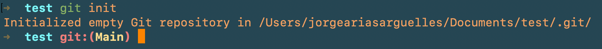
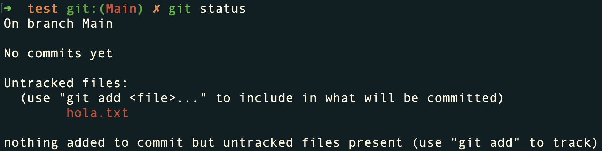
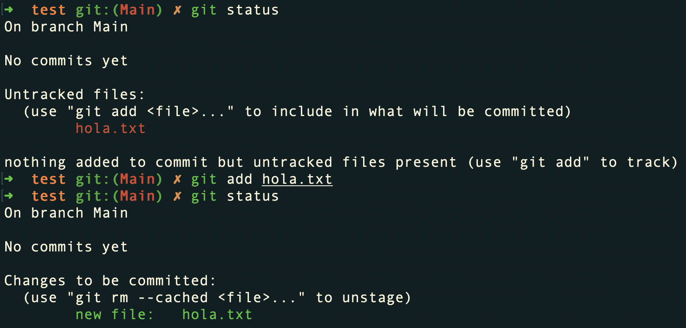
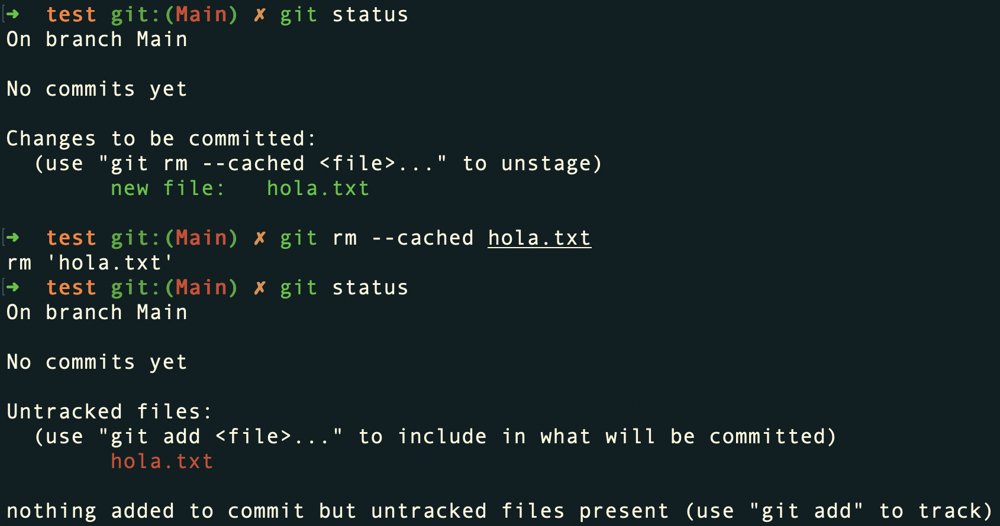

<!-- date: año-mes-día -->

### ¿Qué es Git?

- Es un sistema que guarda los cambios realizados a un archivo de manera atómica.
- Se usa en el computador, por medio de la terminal de comandos.

### Comandos básicos de Git

##### ¿Cómo crear un repositorio local?
Un repositorio local se crea al escribir el comando **git init** y dar *Enter* al interior de la carpeta donde se quiere crear.

Ejemplo visual

  Creacción de un repositorio local en la carpeta/directorio llamado test:
  
  <strong>Nota:</strong> Puedes verificar la existencia del repositorio local con el comando <strong>ls -la</strong> qué nos listara los archivos visibles y los ocultos. En los archivos ocultos se debera ver un archivo <strong>.git</strong>

##### ¿Cómo saber si hay archivos añadidos, borrados o editados en el proyecto? - ¿Cómo saber en cuál rama se esta? - ¿Cómo saber a qué archivos se les ha hecho *commit* o se les está haciendo seguimiento(Tracking)?
Con el comando **git status** y dar *Enter* al interior del proyecto.

  
Ejemplo visual

  

##### ¿Cómo añadir un archivo al escenario o *staging* para hacerle seguimiento(Traking)?
Con el comando **git add** y dar *Enter* al interior del proyecto.

  
Ejemplo visual

  

##### ¿Cómo elimino un archivo del escenario o *staging*?
Con el comando **git rm --cached nombre_del_archivo** y dar *Enter* al interior del proyecto.

Ejemplo visual

holi :)