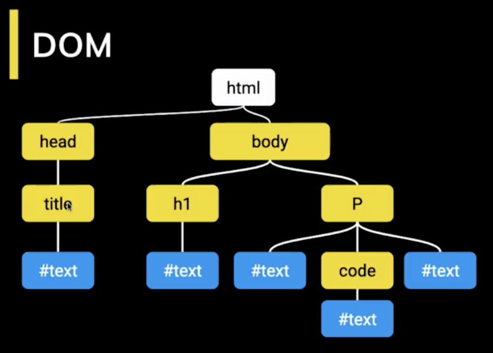

<!-- date: año-mes-día -->

# How does a script get to the browser

First to all, we have to understand what is the DOM and then we will see the 3 way Script get the to the browser.

## What is DOM?

- DOM means Document Object Model
- The DOM is the browser's representation of an HTML document
- When all document is loaded, we get: **DOMContentLoaded** then we can manipulate the DOM.

## 1. External Script or Embedded Scripts 

