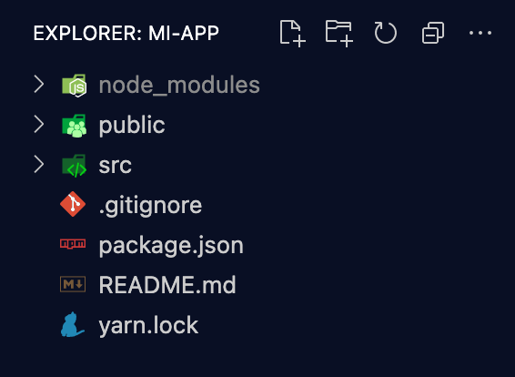
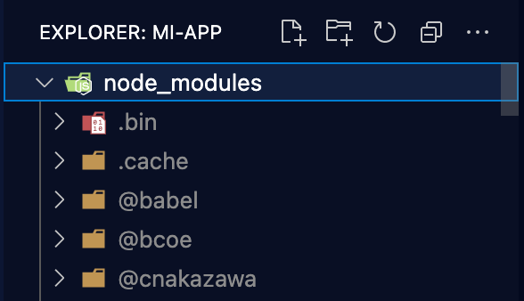
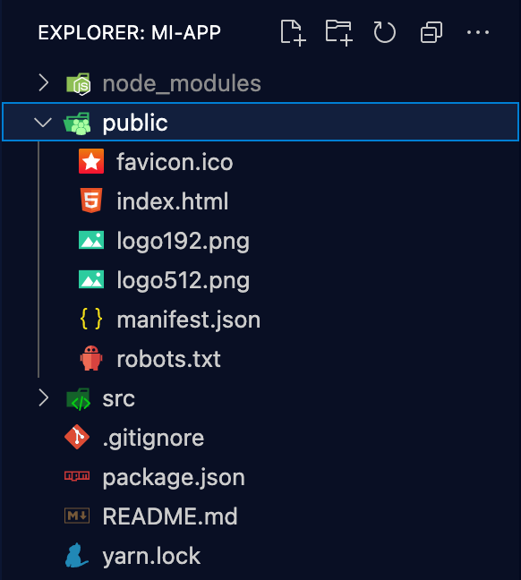
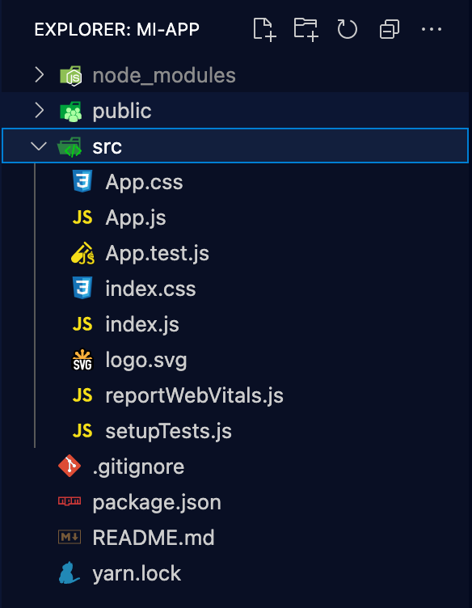
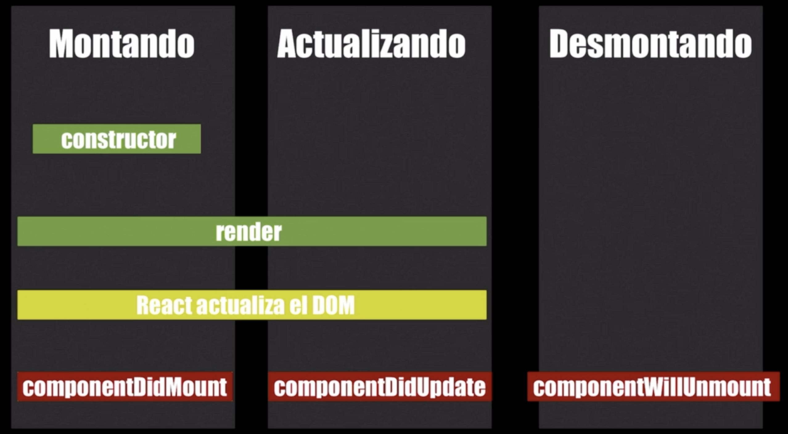

<!-- date: año-mes-día -->

Contenido de este post:

1. create-react-app
2. 

## 1. Creando una aplicación usando: create-react-app

Para crear una nueva aplicación usando React.js podemos usar el paquete _create-react-app_ el cual creará una plantilla inicial. La sintaxis para ejecutar el paquete, es un comando conformada por las siguientes tres partes:
```bash
npx create-reat-app mi-app
```
- **npx:** Es un comando que viene incluido dentro de npm despues de las versiones 5.2 qué lo que hace es: 
    - Ir a a buscar el paquete **_create-reat-app_**
    - Descargarlo
    - Ejecutarlo 
    - Le pasar el argumento: **_nombre-de-la-app_**
Este comando es importante porque así nos aseguramos de trabajar con la última versión del paquete. 

Al ejecutar el comando se descarga todo el paquete y finalmente nos indica unos comando que podriamos utilizar.


- **npm start:** Permite comenzar con el servidor de desarollo.
- **npm run build:** Permite generar un paquete enfocado para su uso en producción. Mimificarlo para que pese menos.
- **npm test:** Permite correr todos los test que hayamos escrito en nuestra app de react
- **npm run eject:** Elimina la herramienta de npm run eject y toma todos los arhciovs de configucarión y los deja en el directorio de nuestra App. Esto se hace cuando uno tiene qué personalizar una app de reaact muy a detalle.


## 2 Analisando la estructura del proyecto



- **Directorios**
    - **node_modules:** Este directorio es gigante porque contiene todas las dependencia necesarias para que podamos ejecutar nuestra aplicación en react.js. 
    
    - **public:** Contiene todos los archivos qué van a ser públicos para los usuarios.
    
    - **src:** Toda aplicación construida con **_create-react-app_** necesita única y exclusivamente dos archivos para poder funciuonar:
        - src/index.html
        - public/index.js (El más importante)
        
    
    - **.gitignore:** Contiene todos los archivos que tnemos que ignorar y no subir al repositorio, como por ejemplo las variables de entorno, las API keys, y otras credenciales.
- **Archivos**
    - **package-log.js** Contiene las dependencia que nosotros hemos instalado par el proyecto, cada dependencia con su versión y url. De esta manera cuando despelguemos la app a producción nos aseguramos de que instale las dependencias en la url indicada con la versión indicada y pueda funcionar.
    - **package.js** Contiene el nombre del proyecto, las dependencias instaladas de desarollo y de proudcción, si el repositoro es privado o publico, los cripts que se ejecutaran, configuración para el Linter.

## 3. Anatomia de un componente basado en clases

La anatomia de un componente basado en Clase contiene 5 elementos:

```js
import { Component } from react; // 1. Importante importar Component

class App extends Component { // 2. Definimos nuestra clase que extiende de Component previamente importado
    render() { // 3. Siempre lleva el método Render
        return ( // 4. Retornamos contenido JSX
            <p>Hola Mundo</p>
        )
    }
}

export default App; // 5. Exportar el componente para reutilizarlo.
```

## 4. El estado en un componente basado en clases

Cuando un componente se crea basado en Clases, se puede acceder directamente al estado. Mientras que si el componente esta creado en base a funcion, para acceder al estado se usn hooks.

Para usar el Estado primero se debe declarar como un objeto literal vacio. El Estado depende de un solo componente, con la opción de pasar a los componentes hijos como propiedades.

El método **Render()** se ejecuta siempre en dos situaciones:
1. Cuando el estado del componente haya cambiado, es decir, cuando llamamos el método **setState()**
2. Cuando el método **render()** del componente padre haya sido llamado, entonces el método **render()** de los hijos se llaman automaticamente.

```js
import { Component } from react;

class App extends Component { 
    
    state = {
        valor: 1
    }

    render() { 
        console.log("Mi estado:",this.state);
        return ( 
            <div>
                <p>Hola Mundo</p>
                <button 
                    clasName={`${this.state.valor}`}
                    onClick={()=> this.setState({ valor: 2 })}
                >
                    Enviar
                </button>
            </div>
        )
    }
}

export default App; 
```

## 5. Ciclo de vida de los componentes

¿Cuando se renderiza un componente?


```js
import { Component } from react;

class Button extends Component{
    render(){
        console.log("Ejecutando método render de Boton")
        return(
            <button 
            >
                Enviar desde boton
            </button>
        )
    }
}


class App extends Component { 
    
    state = {
        valor: 1
    }

    render() { 
        return ( 
            <div>
                <p>Hola Mundo</p>
                <Button />
                <button 
                    clasName={`${this.state.valor}`}
                    onClick={()=> this.setState({ valor: 2 })}
                >
                    Enviar desde App
                </button>
            </div>
        )
    }
}

export default App; 
```



### 5.1 Montando componentes

Para Montar componentes se debe agregar la función constructura, que va localizada entre la Clase y el método render().

- El método de **componentDidMount(){};**
    - No recibe ningun argumento
    - Se utiliza cuando tenemos que llamar el método **setState()** para actualizar el estado de nuestro componente.
    - Este método lo tenemos que utilizar si queremos evaluar algo de nuestro DOM para ver si queremos mostrar agçun modal o hacer llamadas AJAX para traer datos de una API.
    - Order de ejecución:
        - Método constructor: Se utiliza para establecer propiedads del estado por defecto.
        - Método render: 
        - Método componentDidMount: Se utiliza para actualizar el estado luego de haber realizado un reder()

```js
import { Component } from react;

class Button extends Component{

    constructor(props){
        super(props) // Hace referencia al componente del cual estamos extendiendo.
        console.log("Constructor:", props)
    }

    componentDidMount(){
        console.log("Component Did Mount :)");
    }

    render(){
        console.log("Ejecutando método render de Boton")
        return(
            <button 
            >
                Enviar desde boton
            </button>
        )
    }
}


class App extends Component { 
    
    state = {
        valor: 1
    }

    render() { 
        return ( 
            <div>
                <p>Hola Mundo</p>
                <Button />
                <button 
                    clasName={`${this.state.valor}`}
                    onClick={()=> this.setState({ valor: 2 })}
                >
                    Enviar desde App
                </button>
            </div>
        )
    }
}

export default App; 
```

### 5.2 Actualizando componentes

- El método de **componentDidMount(){};**
    - Recibe dos argumentos:
        - La propiedad **prevProps**
        - La propiedad **prevState**
    - Este métdo no se ejecuta la primera vez que se monta un componente
    - Solo se ejecuta cuando el componente cambia, es decir, cuando se llama el método render() a traves del **setState()**

```js
import { Component } from react;

class Button extends Component{

    constructor(props){
        super(props) // Hace referencia al componente del cual estamos extendiendo.
        console.log("Constructor:", props)
    }

    componentDidMount(){
        console.log("Component Did Mount :)");
    }

    componentDidUpdate(prevProps, prevState){
        console.log("Component Did Update :))", "Props previas:" ,prevProps, "Estado previo:",prevState);
        
    }

    render(){
        console.log("Ejecutando método render de Boton")
        return(
            <button 
                onClick={()=> this.setState({ props: 1})}}
            >
                Enviar desde boton
            </button>
        )
    }
}


class App extends Component { 
    
    state = {
        valor: 1
    }

    render() { 
        return ( 
            <div>
                <p>Hola Mundo</p>
                <Button />
                <button 
                    clasName={`${this.state.valor}`}
                    onClick={()=> this.setState({ valor: 2 })}
                >
                    Enviar desde App
                </button>
            </div>
        )
    }
}

export default App; 
```

### 5.3 Desmontando componentes

- El método de **componentWillUnmount(){};**
    - No recibe ningún argumento

```js
import { Component } from react;

class Button extends Component{

    constructor(props){
        super(props) // Hace referencia al componente del cual estamos extendiendo.
        console.log("Constructor:", props)
    }

    componentDidMount(){
        console.log("Component Did Mount :)");
    }

    componentDidUpdate(prevProps, prevState){
        console.log("Component Did Update :))", "Props previas:" ,prevProps, "Estado previo:",prevState);
    }

    componentWillUnmount(){
        console.log("Component Will Unmount :)))", "Props al momento de desmontar:",this.props, "Estado al momento de desmontaje:",this.state);
    }

    render(){
        console.log("Ejecutando método render de Boton")
        return(
            <button 
                onClick={()=> this.setState({ props: 1})}}
            >
                Enviar desde boton
            </button>
        )
    }
}


class App extends Component { 
    
    state = {
        valor: 1
    }

    render() { 
        return ( 
            <div>
                <p>Hola Mundo</p>
                {
                    this.state.valor === 3
                        ? <Button chanchito="Feliz"/>
                        : null
                }
                <button 
                    clasName={`${this.state.valor}`}
                    onClick={()=> this.setState({ valor: 2 })}
                >
                    Enviar desde App
                </button>
            </div>
        )
    }
}

export default App; 
```

## 6. ¿Donde gestionamos el estado de nuestra aplicación?

La sigueinte práctica se concoe como: Levantar el estado de un componente.

```js
import { Component } from react;

class Input extends Component {
    render(){
        return (
            <input
                value={this.props.value}
                onChange={this.props.onChange}
            />
        )
    }
}

class App extends Component {
    state = {
        nombre: "",
        apellido: ""
    };

    updateValues = (props, value) => {
        this.setState({ [props]: value } ); // Sintaxis de las propiedades dínamicas [props]
    };

    render(){
        return (
            <p>
                Nombre completo: {`${this.state.nombre} ${this.state.apellido}`}
                <Input 
                    value={this.state.nombre}
                    onChange={e => this.updateValues('nombre', e.target.value)}
                />
                <Input 
                    value={this.state.apellido}
                    onChange={e => this.updateValues('apellido', e.target.value)}
                />
            </p>
        )
    }
}

export default App;

```


## 7. Componentes basados en funciones - Hooks

Un componente funcional la podemos definir:
- Como una constante a la cúal le asignamos una fat arrow function, con la primera latra del nombre en Mayuscula
```js
const App = () => {
    return (

    )
};

export default App;
```
- Como una función tradicional, con la primera latra del nombre en Mayuscula
```js
function App(){
    return(

    )
};

export default App;
```
### Caracteristicas de los componentes basados en funciones
- Los componentes basados en funciones son funciones puras: Aquellas que nunca cambian el valor de retorno
- 

Los componentes funcionales tambien reciben propiedades y hay dos maneras de desetructurarla:
- Versión A:
```js
const Micomponente = (props) => {
    const { miProp } = props;

  return (
    <div>
      Nombre: {miProp}
    </div>
  )
}

const App = () => {
  return(
    <Micomponente miProp={'Chanchito feliz'} />
  )
}

export default App;
```
- Versión B:
```js
const Micomponente = ({ miProp }) => {
  return (
    <div>
      Nombre: {miProp}
    </div>
  )
}

const App = () => {
  return(
    <Micomponente miProp={'Chanchito feliz'} />
  )
}

export default App;
```

## 8. Hooks: useState para manejar el estado

### Reglas de los hooks
1. Los hooks no se llaman al interior de ciclos ni estructuras de controsl, deven estar al nivel más alto del componente
2. Solo se llaman en dos partes: Componentes de React.js, Custom hooks / Hoosk personalizados
3. Cuando creemos un CustomHook, este siempre debe llamarse useNombre_Del_Hook


