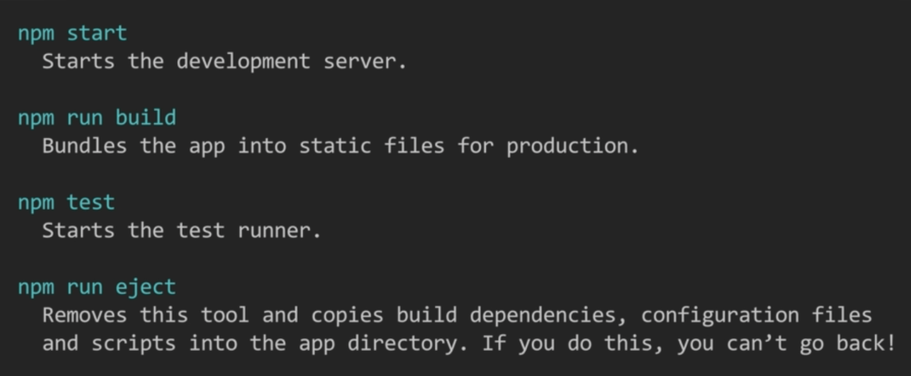

<!-- date: año-mes-día -->

Contenido de este post:

1. create-react-app
2. 

# 1. Creando una aplicación usando: create-react-app

Para crear una nueva aplicación usando React.js podemos usar el paquete _create-react-app_ el cual creará una plantilla inicial. La sintaxis para ejecutar el paquete, es un comando conformada por las siguientes tres partes:
```bash
npx create-reat-app nombre-de-la-app
```
- **npx:** Es un comando que viene incluido dentro de npm despues de las versiones 5.2 qué lo que hace es: 
    - Ir a a buscar el paquete **_create-reat-app_**
    - Descargarlo
    - Ejecutarlo 
    - Le pasar el argumento: **_nombre-de-la-app_**
Este comando es importante porque así nos aseguramos de trabajar con la última versión del paquete. 

Al ejecutar el comando se descarga todo el paquete y finalmente nos indica unos comando que podriamos utilizar.



- lll
- lll
- dddd
- ddd

