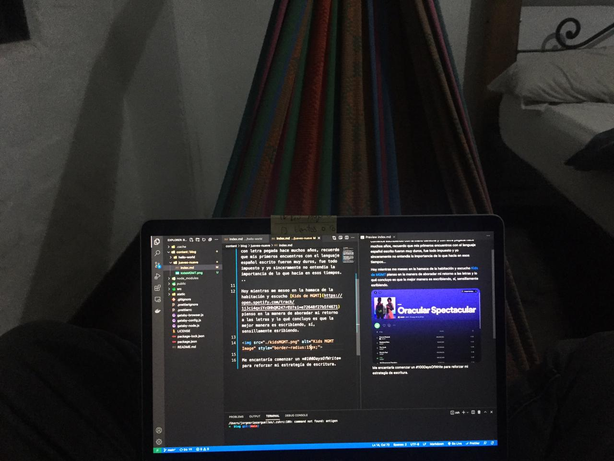
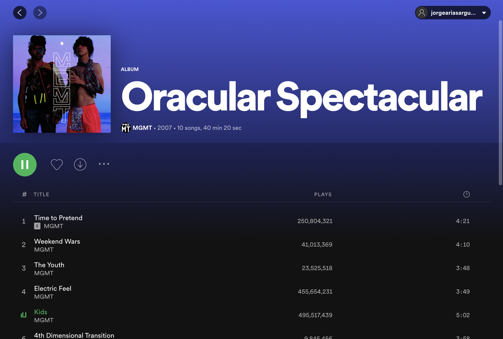

<!-- date: año-mes-día -->

Hoy es jueves nueve de Septiembre y estoy continuando mi camino como escritor.

Comence escribiendo con la mano derecha y con letra pegada hace muchos años, recuerdo que mis primeros encuentros con el lenguaje español escrito fueron muy duros, fue todo impuesto y yo sinceramente no entendia la importancia de lo que hacia en esos tiempos...

Hoy mientras me meseo en la hamaca de la habitación y escucho [Kids de MGMT](https://open.spotify.com/track/1jJci4qxiYcOHhQR247rEU?si=e72648f27b5f4671) pienso en la manera de aboradar mi retorno a las letras y lo qué concluyo es que la mejor manera es escribiendo, sí, sensillamente esribiendo.

Entonces voy a comenzar un _#100DaysOfWrite_ para reforzar mi estrategía de escritura.
