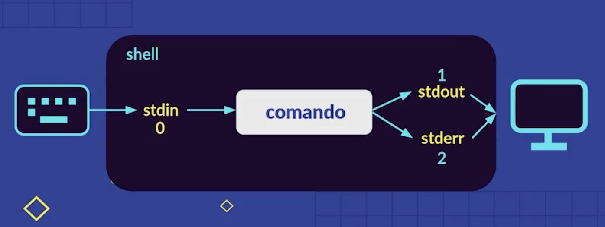
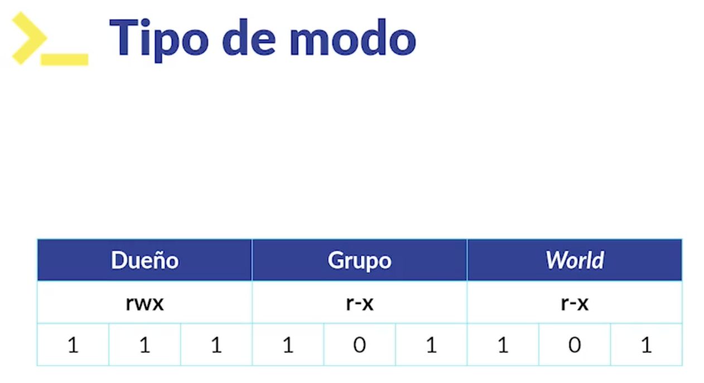
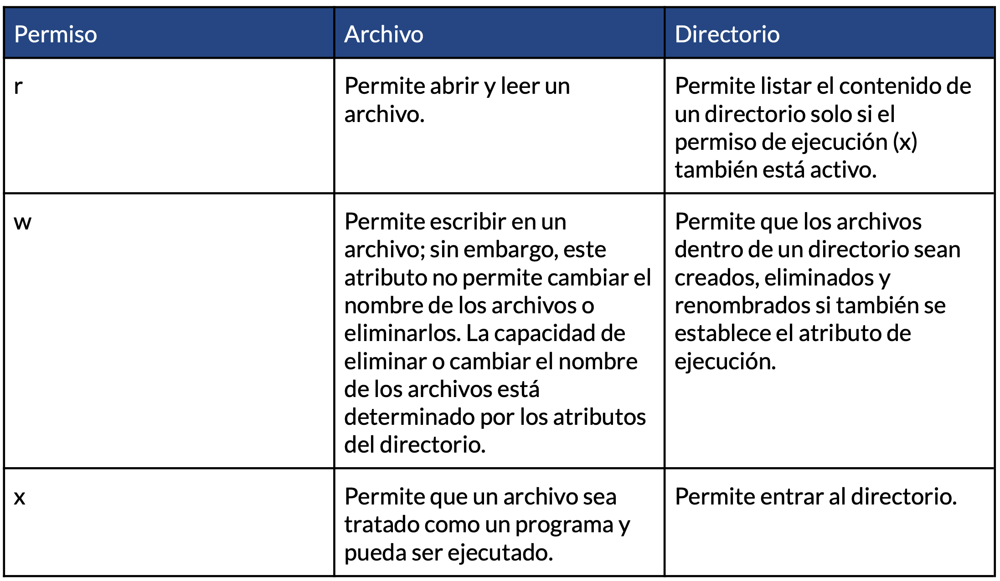
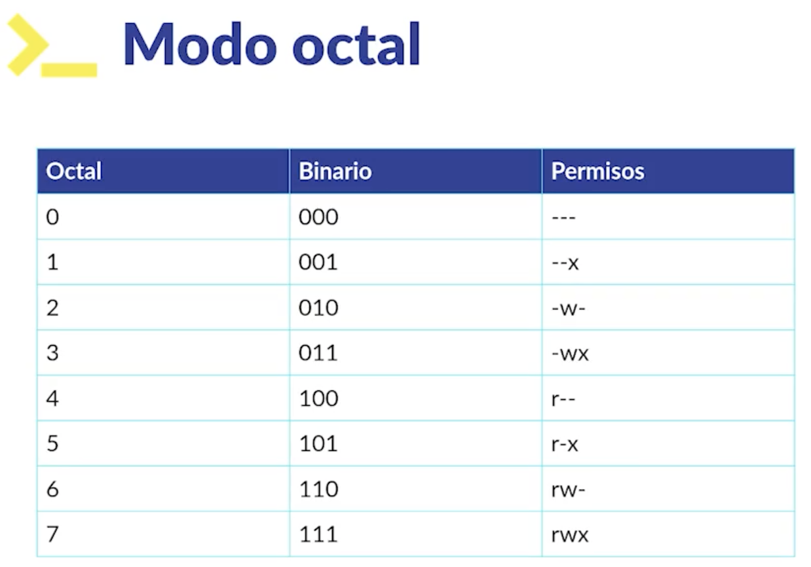
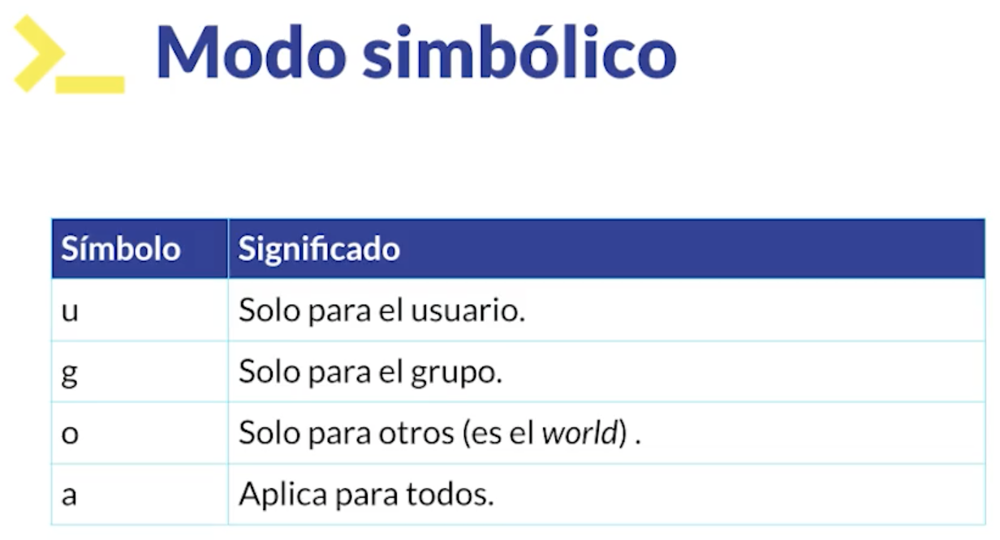

<!-- date: año-mes-día -->
###  1. ¿Qué es la terminal?
Es una interfaz gráfica qué simula una linea de comandos, cuando hablamos de una linea de comandos hablamos de una _**shell**_
- **Terminal:** Es la ventana negra qué nos muestra el _**prompt**_ (Este aloja el shell)
- **Lineas de comandos (Shell):** Un programa que toma comandos, los interpreta y los pasa al sistema operativo para hacer algo.
- **Comando:** Es un programa qué se puede ejecutar desde la terminal, puede recibir parámetros y opciones.

### 2. ¿Qué es un comando?
Un comando puede ser 4 cosas:
- Un programa ejecutable
- Un comando de utilidad de ala shell
- Una función de la shell
- Un alias

### 3. Comandos para moverse en la terminal
- **/:** Se le llama la raiz del sistema de archivos y desiende cómo un arbol
- **ls:** Listar todos los archivos contenidos en la carpeta en la que estoy
  - **ls -lS:** Listar archivos de acuerdo a su tamaño
  - **ls -lSh:** Listar archivos para ver su peso de una manera más legible
  - **ls -le:** Listar archivos en orden alfabéticos al revés
  - **ls -a:** Listar archivos ocultos
  - **ls _nombre_directorio_siguiente _:** Listar archivos al interior del directorio
  - **tree:** Permite ver todos los directorios del coputador en un diagrama de arbol
    - **tree -L _#_niveles_a_profundizar_:** Permite elegir hasta qué nivel muestra el diagrama de arbol con archivos
- **ctrl c:** Permite cerrar, finalizar o matar un proceso qué se este ejecutando en la terminal.
- **echo _"texto_ejemplo"_:** Permite mostrar en la terminal el emnsaje que se le indique.
****
- **pwd:** Permite identificar la ruta en la que estamos en nuestro sistema
- **mkdir _nombre_directorio_:** Permite crear un directorio
  - **mkdir _nombre1_ _nombre2_ _nombre3_:** Permite crear varios directorios a la misma vez 
- **rmdir _nombre_directorio_:** Permite eliminar un directorio
****
- **cd:** Permite moverse entre las carpetas (change directory).
  - **cd _nombre_carpeta_** permite ingresar a una carpeta ("Adelante")
  - **cd ..** permite salir una carpeta ("Atras")
  - **cd** permite ir directamente a la raiz (/)
- **clear o ctrl l:** Permite limpiar la consola totalmente
  - **command l** permite limpiar la linea anterior
****
- **touch _nombre_archivo_:** Permite crear un archivo
  - **touch _nombre1_ _nombre2_  _nombre3_:** Permite crear varios archivos a la misma vez 
- **cp _archivo_a_copiar_ _nombre_de_la_copia_:** Permite copiar un archivo
- **mv _nombre_archivo_ _ruta_directorio_destino_:** Permite mover un archivo
  - **mv _nombre_archivo_ _nuevo_nombre_archivo_:** Permite renombrar un archivo
  - **mv _nombre_directorio_ _nuevo_nombre_directorio_:** Permite renombrar un directorio
- **file _nombre_archivo_:** Permite ver detalles del tipo de archivo
- **rm _nombre_archivo_:** Permite eliminar un archivo
  - **rm -i _nombre_archivo_:** Permite eliminar un archivo interactivamente
  - **rm -r _nombre_directorio_:** Permite eliminar un directorio y sus archivos contenidos de manera recrusiva.
  - **rm -rf _nombre_directorio_:** Permite eliminar de manera FORZADA un directorio y sus archivos contenidos de manera recrusiva.
  - **rm -ri _nombre_directorio_:** Permite eliminar de manera interactiva un directorio y sus archivos contenidos de manera recrusiva.
  ****
  - **head _nombre_archivo_:** Muestra la cabecera del archivo de texto. Las primeras 10 lineas por defecto.
  - **head _nombre_archivo_ -n  _#lineas_:** Muestra la cabecera del archivo de texto. Las primeras N lineas qué indiquemos.
  - **tail _nombre_archivo_ :** Muestra las últimas 10 lineas del archivo por defecto.
  - **tail _nombre_archivo_ -n  _#lineas_:** Muestra las últimas N lineas del archivo qué le indiquemos.
  - **less:** Tienes una interfaz gráfica e interactiva qué muestra todo el contenido del archivo de texto.
    - **/_termino_a_bucar_:** Permite buscar una palabra en el contenido del archivo
    - **q:** Permite salir de la interfaz gráfica.
  - **open _nombre_del_archivo_:** Permite abrir un archivo con us programa, por ejemplo Word, Excel, etc
  ****
  - **type _nombre_comando_:** Comando qué nos muestra la naturaleza de otro comando
  - **alias _nombre_del_alias_="_comandos_que_componen_el_alias_":** Permite crear palabras claves que pueden contener varios comandos qué usemos recurrentemente.
  - **help _nombre_comando_:** Nos ayuda para ver detalles y funciones de un comando qué le indiquemos
  - **man _nombre_comando_:** Nos muestra el manual de usuario de un comando qué le indiquemos
  - **info _nombre_comando_:** Nos muestra la descripción  de un comando qué le indiquemos
  - **whatis _nombre_comando_:** Permite saber la naturaleza de un comando qué le indiquemos
****
#### 4. WildCards
Son una serie de caracteries especiales qué nos permiten encontrar patrones para hacer busquedas avanzadas de archivos o directorios. Las wildcards se usan conjuntamente con los comandos **ls**,**mv**,**cp**,**rm**
- **ls \*_patrón_de_busqueda_:** Muestra todos los archivos qué coinciden con el aptrón de busqueda (Estención de archivos, nombres de archivos o nombres de directorios).
  - **ls \*.txt:** Enlista todos los archivos con extención **.txt**
- **ls _patrón_de_busqueda_\*:** Muestra todos los archivos qué coinciden con el aptrón de busqueda (Estención de archivos, nombres de archivos o nombres de directorios).
  - **ls _datos_\*:** Muestra todos los directorios que se llamen _datos_ y tengan cualquier caracter despues del nombre.
  - **ls _datos_\?:** Muestra todos los directorios que se llamen _datos_ y tengan un solo caracter despues del nombre.
  - **ls _datos_\??:** Muestra todos los directorios que se llamen _datos_ y tengan dops caracteres despues del nombre.
- **ls [[:lower:]]:** Muestra todos los archivos y directorios qué su nombre empiece con letra minuscula. La busqueda la hace en el primer, segundo y tercer nivel.
- **ls [[:upper:]]:** Muestra todos los archivos y directorios qué su nombre empiece con letra mayuscula. La busqueda la hace en el primer, segundo y tercer nivel.
- **ls -d [[:upper:]]:** Muestra solamente los directorios qué su nombre empiece con letra mayuscula.
****
#### 5. Redireccionamientos

##### 5.1 Como funciona la Shell

- **ls Pictures > _nombre_archivo.txt_ :** Guardamos todos los nombres de los archivos al interior del directorio **Pictures** en el archivo que se indique. Si el archivo no existe, automáticamente se crea.
  - **ls Pictures > _archivo.txt_ :** Guardamos todos los nombres de los archivos al interior del directorio **Pictures** en el archivo _archivo.txt_
  - **ls Download > _archivo.txt_ :** Guardamos todos los nombres de los archivos al interior del directorio **Download** en el archivo _archivo.txt_ sobre escribiendo los datos anteriormente guardados.
  - **ls Download >> _archivo.txt_ :** Guardamos todos los nombres de los archivos al interior del directorio **Download** en el archivo _archivo.txt_ concatenando (consevarngo) los datos anteriormente guardados.
  - **ls djksjhxjd 2> error.txt:** Redirigir el Standar Error en el archivo error.txt.
  - **ls djksjhxjd > output.txt 2>&1:** Redirigir el Standar Output(1) & el Standard Error(2) en el archivo output.txt.

##### 5.2 Pipe operator |

El _pipe opertor_ permite ejecutar un comando y qué su _standar output_ se combierta en el _standar input_ a otro comando. Permite generar filtros, encademanientos o funcionalidades.

- **echo _"texto_ejemplo"_:** Permite mostrar en la terminal el emnsaje que se le indique.
- **cat _archivo1.txt archivo2.txt_:** Permite concatenar el contenido del archivo1.txt en el contenido del archivo2.txt.

##### 5.3 Operadores de control

Son simbolos reservados por la terminar que nos permiten ejecutar más de un comando (concatenandolos), podemos correrlos sincronamente, asincronamente o condicionalmente.

- **Comandos separados por punto y coma ";" :** Se ejecutan uno seguido del otro en el orden en que fueron puesto. Uno no se ejecuta hasta que el otro proceso aya terminado.
  - **comando1; comando2; comando3;** 
- **Comandos separados por \"&" :** Por cada comando qué se ejecute asincronamente se va a abrir una CLI en segundo plano. Usa un hilo de mi procesador por cada comando qué este ejecutando.
  - **comando1 & comando2 & comando3** 
- **Comandos separados por "&&" :**  Se ejecutan solo si el comando anterior se aya ejecutado exitosamente. Suponemos que A, B y C son comando: **A && B && C**
El B solo se va ejecutar si el A se ejecuta exitosamente, y el C solo se va ejecutar si el B si ejecuta exitosamente. Si el B no se ejecuta exitosamenta el C no se ejecuta. Si el A no se ejecuta exitomante el B y el C no se ejecutan.
  - **comando1 && comando2 && comando3** 
- **Comandos separados por "||" :** Solo se ejecuta uno. Independientemente de cuantos comandos tienes separados por **||** solo toma en cuenta el primer que se ejecuta exitosamente (bajo la redundacia), y descarta automaticamente los demas. Cuando uno de los comandos se ejecuta exitosamente, descarta los demas comandos.
  - **comando1 || comando2 || comando3** 

#### 6. Manejo de permisos

##### Tipos de archivos
| Atributo | Tipo de archivo | 
| :-------- | :------- |
| `-` | `Un archivo normal` |
| `d` | `Un directorio` |
| `-` | `Un link simbolico` |
| `b` | `Un archivo de bloque especial.` |

