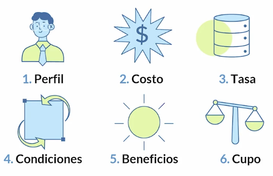

<!-- date: año-mes-día -->

# Credit Card

**What is a credit card?**
- A credit card **is** a financial tool allow us pay and buy based on a permanent and rotative credit line.
- A credit card **is NOT** a income extension 

**How Credit card work?**
- Have a credit limit
- Is possible to pay at the end of month
- Always we payed total mount, it will available to will use again

**Types of Credit Card**

1. Depending on the franchise:
    - Visa
    - MasterCard
    - Diners Club
    - American Express

2. Depending of the entity
    - By Credit bank (Davivienda)
    - By a store like ScotiaBank & PriceSmart
    - By commercial / buy focus (Itau have a lot of discount in any brands)

3. Depending to your beneficiary
    - Personal. Help to improve financial score
    - Protected. Not help to improve financial score
    - Business. 

4. Depending the benefits
    - Reward
        - Points
        - Miles
        - Cashback 
        - Coverage
    - No reward
        - Coverage

Tips to choice your Credit card:

