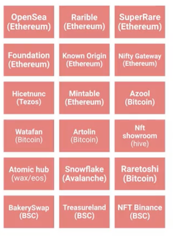
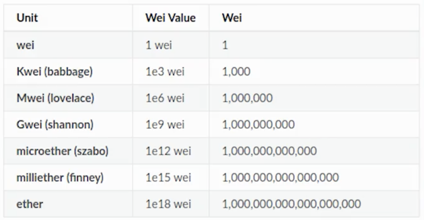

<!-- date: año-mes-día -->

# Creating your first NFT

## WHat is a Non Fungible token - NFT/

A token is a coin use to pay something inside a context, like a casino coin.

When a token is fungible, each token have the same value. In the NFT case each token have a unique value and unrepeatable.

## NFTs origin and platforms

- 2012 2013 colored coins.
- 2016 Protocol Counter party was create and it let us crate the first NFTs.
- 2017 on Etherium wa created the Crypto kittys
- Where can ia create a NFTs:
  
- **minteo** term is the process to crate a NFT

## What we need before start?

1. File type
2. Inter Planetary File System Storage - IPFS Storage
3. Platform selection
4. Costs and expects
5. Wallet preparation

# Blockchain technology and NFT

- NFT live like transaction on the blockchain
- This decentralize data base is where storage all transaction or tokens

## NFTs characteristics

1. NFT is unique (each transaction is unique)
2. NFt is indivisible
3. NFT is no interoperates
4. NFT is indestructible
5. NFT is verifiable

## How NFT works?

Ethereum is a decentralize blockchain where smart contracts run by Solidity programing language.

Inside Ethereum have tokens. The first tokens added was named **ERC-20** means Ethereum Request for Comments.

To work with NFT was necessary added **ERC-721** token. it means ...
This token is interchangeable and non fungibles.

Then a developers crew created a new token called **ERC-1155** that allow us made fungibles(generate multiple units) and non fungibles(only one exists) tokens.

Ether is the crypto-coin on blockchain Ethereum.
Ether in not equal to Gas.

## Wallets

- Private key
- Public key
- Past phrase

# CryptoArt

1. Traceability
2. Transparency
3. Value transfer
