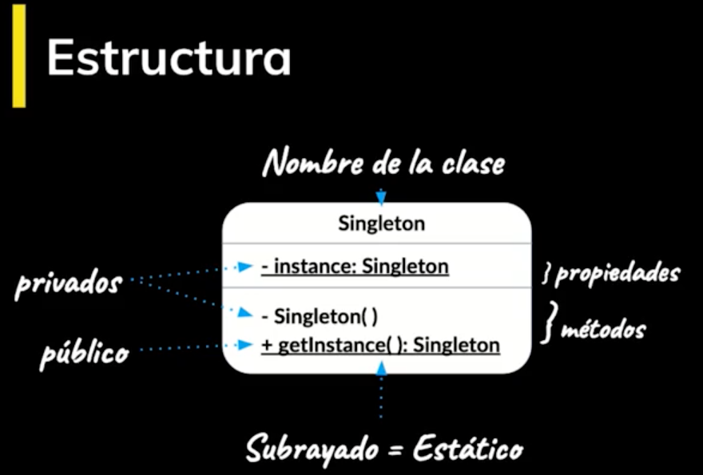

<!-- date: año-mes-día -->

### **What is a Patron?**

- Design patterns are like recipes that solve common problems
  - The context is the situation where the pattern applies
  - The context have to be a recurrent situation

### **Categories of Design Patters**

1. **Creationals:** They provide different mechanisms for creating objects.
   - Abstract Factory
   - Builder
     - Allow create many complex object from a source object.
     - It separates the creation of a complex object from its structure, in such a way that the same construction process allows to create a different representation.
   - Factory Method
   - Prototype
   - Singleton
2. **Structural:** They describe ways to compose objects to form new flexible and efficient structures.

   - Adapter
     - Exposes an external interface and hides a complex interface that can be complex
   - Bridge
   - Composite
   - Decorator
   - Façade
   - Flyweight
   - Proxy

3. **Of Behavior:** They handle algorithms and responsibilities between objects.

- Chain of responsibility
- Command
- Interpreter
- Iterator
- Mediator
- Memento
- Observer
  - An object passes its internal state to many objects that are interested in listening to that state and its changes.
- State
- Strategy
- Template Method
- Visitor

### Going Deeper in some Creational Design patterns

#### **Singleton patter**

- It is a pattern that ensures you that a class has only one instance.
- This single instance can be consumed by any other object.



```ts
export class Singleton {
  private static instance: Singleton

  private constructor() {
    // init
  }

  static getInstance() {
    if (!Singleton.instance) {
      Singleton.instance = new Singleton()
    }
    return Singleton.instance
  }
}
```

```ts
import { Singleton } from "./Singleton"

const a = Singleton.getInstance()
const b = Singleton.getInstance()

console.log("is A equal to B?", a === b)
```

#### **Observer patter**

It consists primarily of two participants, the **subject** and the **observers**.

- The subject offers viewers a subscription mechanism to receive notification of updates.
- Subject offers viewers an unsubscribe mechanism to no longer receive update notifications

```ts
interface Observer {
  update: (data: any) => void
}

interface Subject {
  subscribe: (observer: Observer) => void
  unsubscribe: (observer: Observer) => void
}

class BitcoinPrice implements Subject {
  observersList: Observer[] = []

  constructor() {
    const el: HTMLInputElement = document.querySelector("#value")
    el.addEventListener("input", () => {
      this.notify(el.value)
    })
  }

  subscribe(observer: Observer) {
    this.observersList.push(observer)
  }

  unsubscribe(observer: Observer) {
    const indexObserver = this.observersList.findIndex(obs => {
      return obs === observer
    })
    this.observersList.splice(indexObserver, 1)
  }

  notify(data: any) {
    this.observersList.forEach(obs => obs.update(data))
  }
}

class PriceDisplay implements Observer {
  private el: HTMLElement

  constructor() {
    this.el = document.querySelector("#price")
  }

  update(data: any) {
    this.el.innerText = data
  }
}

const value = new BitcoinPrice()
const display = new PriceDisplay()

value.subscribe(display)

//  Unsubscribe

setTimeout(() => value.unsubscribe(display), 5000)
```

#### Decorator Estructural pattern

- Decorator adds responsibilities to an object dynamically without having to modify its original class.

> Open Closed Principle: "A software entity (Class, Module, function, etc) should be left open for extension and closed for modification."

**SOLID Paradigm:**

- **S:** Single Responsibility Principle (SRP)
- **O:** Open/Closed Principle (OCP)
- **L:** Liskov Substitution Principle (LSP)
- **I:** Interface Segregation Principle (ISP)
- **D:** Dependency Inversion Principle (DIP)
