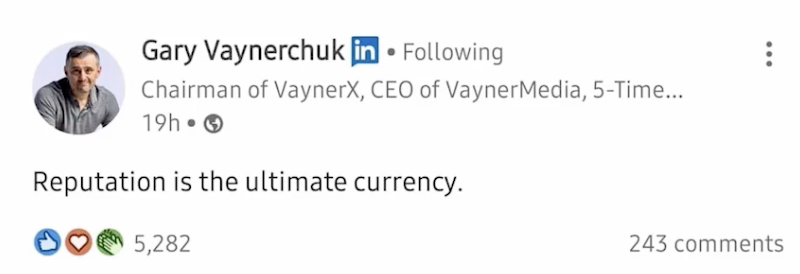

<!-- date: año-mes-día -->

Indice del post:

1. Reputación virtual
2. Posicionamiento profesional
3. Búsqueda laboral

## 1. Reputación virtual

#### ¿Qué es la reputación?
La reputación es la opinion que tiene alguien de algo o alguien más.

La reptación es la moneda que vale, hoy el mercado te valora según tu reputación.

##### Datos a tener encuenta:
> El 70% de los reclutadores usan las redes sociales como fultro de candidatos. by: Career Builder.

> El 57% de los empleadores no aceptaron candiadtos a entrevista por no encontrar información sobre ellos en redes sociales.  by: Career Builder.

#### ¿Cómo medir tu reputación actual en linkedIn?

Mides tú reputación en linkedIn mediante una heramienta gratuita llamada [Social Selling Index - SSI](https://business.linkedin.com/sales-solutions/cx/18/10/sales-navigator-pro-eduvsdr?src=go-pa&trk=sem_lss_gaw&veh=LSS-D_EMEA_ROE_T3_EN_SEM_SEM_GoogleAds_NA_ALL_NA_NA_Core-SA360+Control_DualLP_SocialSelling_Brand_Exact_516565824700__social%20selling%20index_e_c__&mcid=6844060592085471330&cname=LSS-D_EMEA_ROE_T3_EN_SEM_SEM_GoogleAds_NA_ALL_NA_NA_Core-SA360+Control_DualLP_SocialSelling_Brand_Exact&camid=12582465054&asid=125361333251&targetid=kwd-333388456980&crid=516565824700&placement=&dev=c&ends=1&gclid=Cj0KCQiAkNiMBhCxARIsAIDDKNX5gleVz8yYjDB_raQyXwDIWNmFz7z31xs7uXG_5VvgUxDj7qMhdNUaAhldEALw_wcB&gclsrc=aw.ds) 

## 2. Posicionamiento profesional

### 2.1 Define tu objetivo profesional

Establecer tu objetivo profesional es un paso muy importante porque te ayuda a visibilizar:
- A donde quieres llegar (Punto final)
- Donde estas (Punto inicial)
- Y así poder crear el plan para recorrer esa distancia entre el punto inicial y el punto final

## 3. Búsqueda laboral