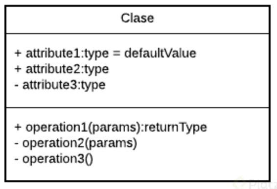

<!-- date: año-mes-día -->

# What OOP resolve?

OOP born to resolve some Structural Programing Problems like these:

- **Very long code:** As a system grows and becomes more robust, the generated code becomes very extensive, making it difficult to read, debug, and maintain.

- **If something fails, everything breaks:** Since with structured programming the code is executed sequentially when one of those lines fails, everything else stops working.

- **Difficult to maintain.**

# OOP Paradigm

> **A paradigm is** a theory that provides the basis and model for solving problems.

OOP comes from **Object Orientation Philosophy** and is conformed by 4 elements and 4 pilar

| Numbers | Elements |     Pilar     |
| :-----: | :------: | :-----------: |
|   1.    | Classes  | Encapsulation |
|   2.    |  Props   |  Abstraction  |
|   3.    | Methods  |  Inheritance  |
|   4.    |  Object  | Polymorphism  |

> **Object = Classes + Props + Methods**

# Modeling Diagrams

- **OMT:** Object Modeling Techniques. It is a methodology for object-oriented analysis.

- **UML:** Unified Modeling Language or Unified Modeling Language. It took the bases and techniques of OMT unifying them. We have more diagram options such as Classes, Use Cases, Objects, Activities, Iteration, States, Implementation.

| Visibility levels |
| :---------------: |
|     - private     |
|     + public      |
|    # protected    |
|     ~ default     |
