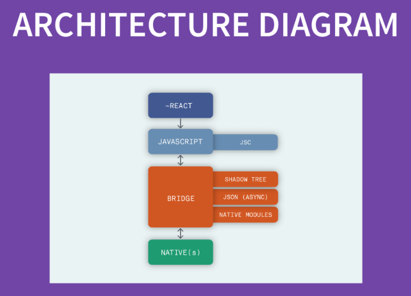

<!-- date: año-mes-día -->

# Syllabus

1. Getting Started
2. Core components
3. Styling components
4. Debugging & troubleshooting
5. Navigation & Final Project

# 1. React Native - Getting Started

## What is React Native

- An open source project to create native apps adding iOS and Android UI control rendering through React and JavaScript
- React Native runs on React. To make the most of React Native, its help to understand React itself.

## What React Native is Not!

- A hybrid or Progressive Web App framework (PWA framework)

## How uses React Native

- Warner Media
- Facebook
- Shopify
- Wix
- ...

## How does React Native work?

### Execution model

In a typical react native app there are at least four threads:

1. UI threads (Main thread)

   Main thread used for native Android and iOS UI rendering

2. Shadow thread

   Layout calculations happen here

3. Native modules thread(s)

   Sometimes an app needs access to platform API, this happens in the native modules thread(s)

4. JS thread

   JS thread is where your applications's JS code is executed:

   - api calls are made
   - touch events are processed
   - etc

## What is the Bridge

In react native, we have two sides:

- JavaScript
- Native

**Between the two is the bridge,** allowing bidirectional and synchronous communications.

## How communication works

This means any value must be sent through:

- Asynchronous callbacks
- Promises
- Events
- Each sent on a batched message queue



# 2. React Native - Core components

## Views and Mobile development

In Android and iOS development, a **view** is the basic building block of UI.

- a **view** is a small rectangular element on the screen which can be used to display text, images, or respond to user input

## Native components

With react Native, you can invoke these views with JavaScript using React components. At runtime, react native creates the corresponding Android and iOS views for those components.

## Core components

React Native has many core components for everything from Form controls to activity indicators
You will mostly work with the following Core components:

- <View>
- <Text>
- <Image>
- <ScrollView>
- <TextInput>

And when dealing with large data sets you will most likely see:

- <FlatList>
- <SectionList>

# 3. React Native - Styling components

## Constructing styles

Style property names are by and large the camel case version of the CSS equivalents

## Way to apply styles

### 1. Inline styles

Similar to HTML, styles in React Native can be applied inline by setting the value of the style property

```js
<View
  style={{
    backgroundColo: "blue",
    flex: 1,
    justifyContent: "center",
    alignItems: "center",
  }}
>
  <Text
    style={{
      color: "#fff",
      fontSize: 22,
    }}
  >
    Hello React Native 101
  </Text>
</View>
```

### 2. Styles as Object

Style values are defined as JavaScript object. You can define them online, or define them outside your component and reference them.

```js
const myComponent = () => (
  <View style={viewStyle}>
    <Text style={textStyle}>Hello React Native 101</Text>
  </View>
)

const viewStyles = {
  backgroundColo: "blue",
  flex: 1,
  justifyContent: "center",
  alignItems: "center",
}

const textStyle = {
  color: "#fff",
  fontSize: 22,
}
```

### 3. How to combine multiples styles

In CSS you can apply multiple CSS classes to an individual element

```js
<button class="btn btn-primary">Submit </button>
```

In react native to combine multiple style definitions we can wrap the style objects in an array.

```js
<View style={[btn, btn - primary]}></View>
```

Object inside the array will merge together, favoring later arguments.

### 4. Stylesheet

A stylesheet is an abstraction similar to CSS StyleSheets

- By moving styles away from the render function you are making the code easier to understand.
- Naming the styles is a good way to add meaning to the low level components in the render function

**How we create Stylesheet object**

```js
Stylesheet.create({
  container: { flex: 1 },
  innerItem: { padding: 24 },
})
```

**StyleSheet styles can be composed**

```js
Stylesheet.compose(myStyleSheetA.styleA, myStyleSheetB.styleB)
```

**StyleSheet styles can be flattened**

```js
const flattenStyle = Stylesheet.flatten([
  myStyleSheetA.styleA,
  myStyleSheetB.styleB,
])
```

## Why should you use StyleSheet?

- Making a Stylesheet from a style object makes it possible to refer to it by ID instead of creating a new style objet every time
- This allows sending the style only once through the bright. All subsequent uses are going to refer an ID
- Invalid styles throw an error

# Styling without Inheritance

- In React Native styles are almost entirely scoped to the elements where they are applied
- Rather than relying on global styles, you are encouraged to create reusable components that encapsulate styles

```js
const ReusableButton = ({ style, children, ...othersProps }) => (
  <TouchableHighlight
    style={[generalStyles.text, generalStyles.button, style]}
    {...othersProps}
    activeOpacity={0.8}
  >
    {children}
  </TouchableHighlight>
)

Button.propTypes = {
  style: TouchableHighlight.propTypes.style,
  children: React.Proptypes.node,
}
```
