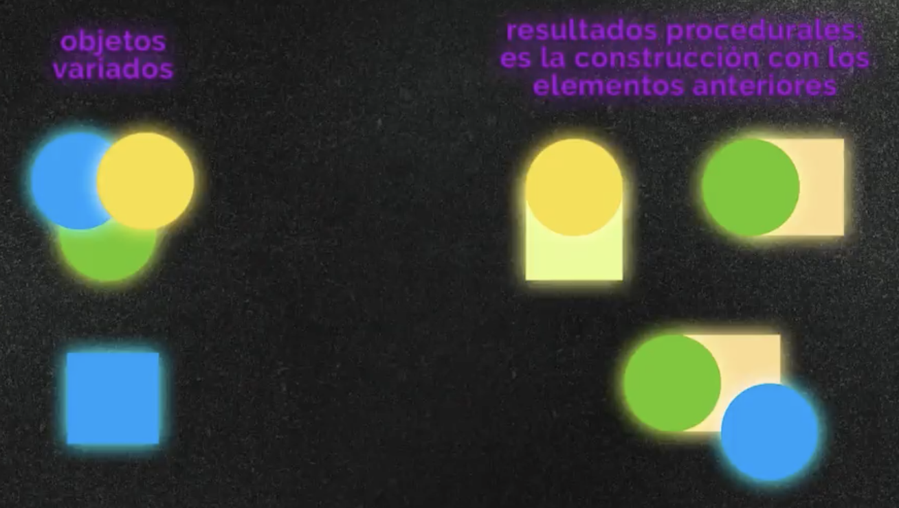

<!-- date: año-mes-día -->

#### Sistema de Diseños

Los sistemas de diseño están en todas partes, su función tiene que ver con la planeación y la construcción de productos.

Un sistema de diseño es un conjunto de reglas para un producto que puede mutar segun la necesidades del mismo. Un aspecto importante es que pueda ser consultado por todas las partes involucradas.

##### Partes del Design System:
1. **Principios:** 
    Los principios del diseño son la base fundamental de los paradigmas y metodologías que aplicaremos en nuestro sistema. Todas las decisiones que tomemos deben tener en cuenta y fundamentarse en estos principios, así evitamos cometer errores o generar conflictos, ya que todos los caminos serian correctos.

    - **Accesibilidad:** Nuestro producto debería ser usable para cualquier usuario, debemos construir productos perceptibles, operables, entendibles y robustos.
    - **Consistencia:** Todo el equipo deben tener los mismos objetivos y deben hablarle de la misma forma a los usuarios, sea visualmente o por escrito.
    - **Reusabilidad:** Cada hora que invirtamos trabajando en algún componente debe servir para construir otros componentes y evitar que tu o alguien más tenga que reconstruir nuestro trabajo.
    - **Shareable:** Debemos construir y trabajar con herramientas que nos permitan compartir todo nuestro trabajo.

<a href="https://principles.design" target="_blank">Ejemplos de principos del sistema de diseño </a>

2. **Sistema:** Cual va a ser el flujo de creación (tiempos y forma)
    - **Design System Workflow:** nos ayuda a entender mucho mejor cómo entra, por dónde sale y por cuáles puntos pasa nuestro trabajo cuando trabajamos con sistemas de diseño. En este workflow o flujo de trabajo comenzamos diseñando y documentando para después hacer deploy (un término de programación para los momentos en que pasamos nuestro trabajo a producción, una versión funcionando en vivo), en esta etapa de deploy debemos tener muy claro para cuál plataforma o entorno estamos trabajando, así tendremos mucho más claro todo lo que vamos a necesitar construir (por ejemplo, cuando construimos páginas web trabajamos en archivos .css con los estilos de nuestros productos).
    - **Building Design Systems:** donde construimos herramientas para que todos puedan usar e implementar las guías y los estilos que estamos trabajando. Para organizarnos y sistematizar estos procesos podemos implementar el modelo solitario, dónde tú, el diseñador haces todo el trabajo para que alguien más lo consuma, pero existen otros modelos como el centralizado o el confederado donde trabajamos con otras personas o incluso otros equipos y pedimos feedback dependiendo de la organización de nuestras empresas.
    - Tipos de modelo organizativos
        - **Solitario:** Tu construyes, los demás consumen.
        - **Centralizado:** Tu tienes un equipo siendo tú el diseñador. Puedes consultar a otras partes o a otros dptos construyendo un sistema de diseño.
        - **Confederado:** Disponer de varios equipos en diferentes dptos y entre todos se construye el sistema hacia adentro y posteriormente se itera (CEO, clientes…). Aunque en última instancia la responsabilidad es nuestra como diseñadores en tomar decisiones.
3. **Foundations:** Bases de todo lo visual. Los sistemas de diseño son un conjunto de reglas que organizamos con nuestros equipos, y los fundations son las partes más básicas que podemos configurar en nuestro sistema.

    - Tipografía
    - Colores
    - Layout y spaces (son las formas y espacios fundamentales que utilizamos para ordenar los elementos de nuestro sistema)
    - Iconografía
    - Styles (nuestra marca puede presentarse con estilos juguetones o realistas, lo importante es definir tan claro como sea posible qué intentamos transmitir)
    - Tono (con qué personalidad o de qué forma debemos hablar con nuestra audiencia)
4. **Componentes:** Los componentes forman parte de un todo, así como las velas de un pastel, el piso de los edificios o las partes de un motor cada una con su funcionalidad. Lo mismo pasa con las interfaces, vamos a construir diferentes elementos y herramientas para que los usuarios logren cumplir sus objetivos.

Todos los componentes tienen una entrada y una salida, el usuario realiza una acción y los elementos deben responder de alguna forma (feedback), esta es la forma de comunicamos con los usuarios, trabajamos haciendo conversaciones para informar que todo esta funcionando correctamente y qué pasos deben seguir a continuación. Este proceso de comunicación lo conocemos como interacción.

Partes de un componente:
  - **Nombre:** así evitamos diferentes definiciones y establecemos los objetivos y funciones de nuestros componentes
  - **Descripción y solución:** en qué problema estamos trabajando y cómo deberíamos implementar estas soluciones
  - **Behavior:** el comportamiento de nuestros componentes dentro del sistema
  - **States:** las variaciones y distintos comportamientos que pueden tener nuestros componentes dependiendo de su contexto

##### Paradigmas de Design System:

- **Diseño procedural:** Son elementos ya hechos que hacen que el resultado sea variable. Es la construcción de funcione que a futuros se van a construir así mismas.

- **Diseño Atómico:** 
<a href="https://platzi.com/blog/por-que-atomic-design/" target="_blank">¿Porqué usar Atomic Design? </a>

- **DRY:** Se trabaja mucho en progamación. **_Don`t Repaat Yourself_**

##### Tipografías

Cuando trabajamos con tipografía para software debemos tener en cuenta las implicaciones que estas pueden generar si trabajamos para dispositivos móviles o los requerimientos técnicos de alguna pantalla en particular. Un buen lugar para encontrar tipografías listas para el desarrollo y diseño de nuestros productos es Google Fonts.

Para definir y clasificar las características y peculiaridades en los elementos de nuestro diseño podemos basarnos las etiquetas de HTML para títulos y encabezados (H1, H2, H3, H4, H5 y H6), párrafos (p) y párrafos más pequeños (small). Podemos definir que los títulos se trabajen en negrita y con tamaños de fuente más grandes, lo importante es que estas reglas se acomoden al sistema de diseño que estamos trabajando.

##### Colores

Los colores también deben llevar algún tipo de clasificación ya que definen el estilo visual de nuestro sistema. La paleta de colores define el estilo de tu sistema de diseño y ayuda a definir el sistema de diseño, diferenciando la identidad de la marca y del resto de efectos y elementos visuales.

Muchos sistemas de diseño clasifican sus colores según sus productos (un color para ventas, otro para servicio al cliente, etc), otros utilizamos Material Design y clasificamos los colores como actions colors, _secondary colors _ y otros niveles de clasificación. En realidad no importa, podemos tomar cualquier otro paradigma de fundamentos de color para nuestros sistemas, lo importante es clasificar el uso de estos colores y asegurarnos de que todo el equipo los entiende.

Para escoger estos colores debemos tener en cuenta los colores de la marca, los colores principales (colores de acción o call to actions), colores secundarios, los grises y los colores de fondo. El trabajo se puede complicar un poco cuando tenemos en cuenta todos estos colores, pero el resultado será mucho mejor, los colores funcionaran correctamente entre todos.

- [Teoría del Color en el diseño de interfaces](https://platzi.com/blog/color-en-interfaces/)
- [Cómo hacer un diseño efectivo con jerarquía visual - Blog de Platzi](https://platzi.com/blog/jerarquia-visual/)
- [My struggle with colors](https://uxdesign.cc/my-struggle-with-colors-52156c664b87)

##### Animaciones

- [Animaciones en CSS](https://animate.style)

