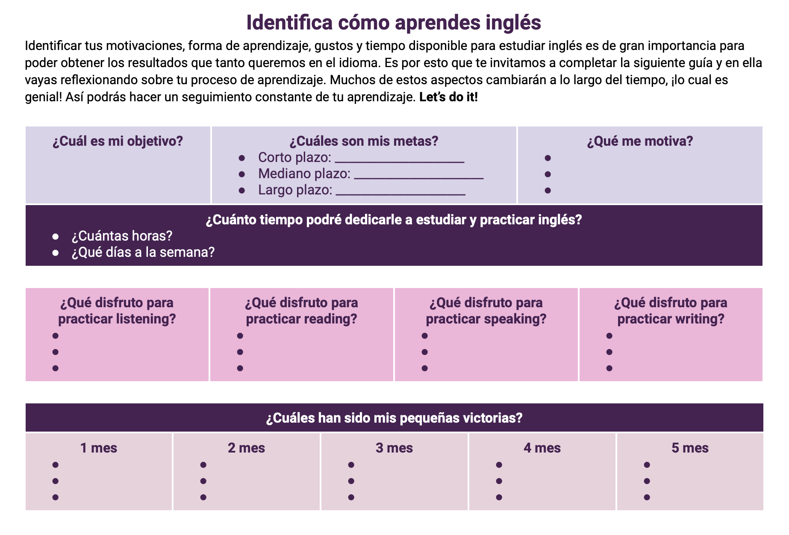

<!-- date: año-mes-día -->

# Why learn english

> "The limit of my language mean the limit of my world" by Ludwig Wittgenstein

**What os English necessary for:**

- Travelling the world
- Getting a better job opportunities
- Studying abroad of higher education
- Personal growth

## Set SMART Goals

- S: Specific
- M: Measurable
- A: Achievement
- R: Relevant
- T: Time based

## How I start my learning path

1. Set SMART Goals
2. Dedicated time
3. Progressive Advance
4. What works for me and what I enjoy doing

