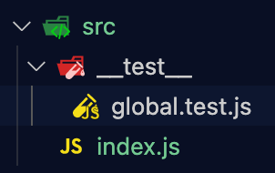
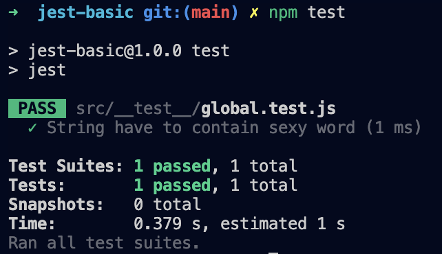
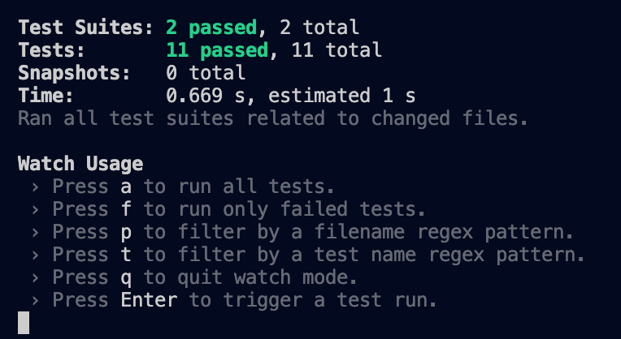
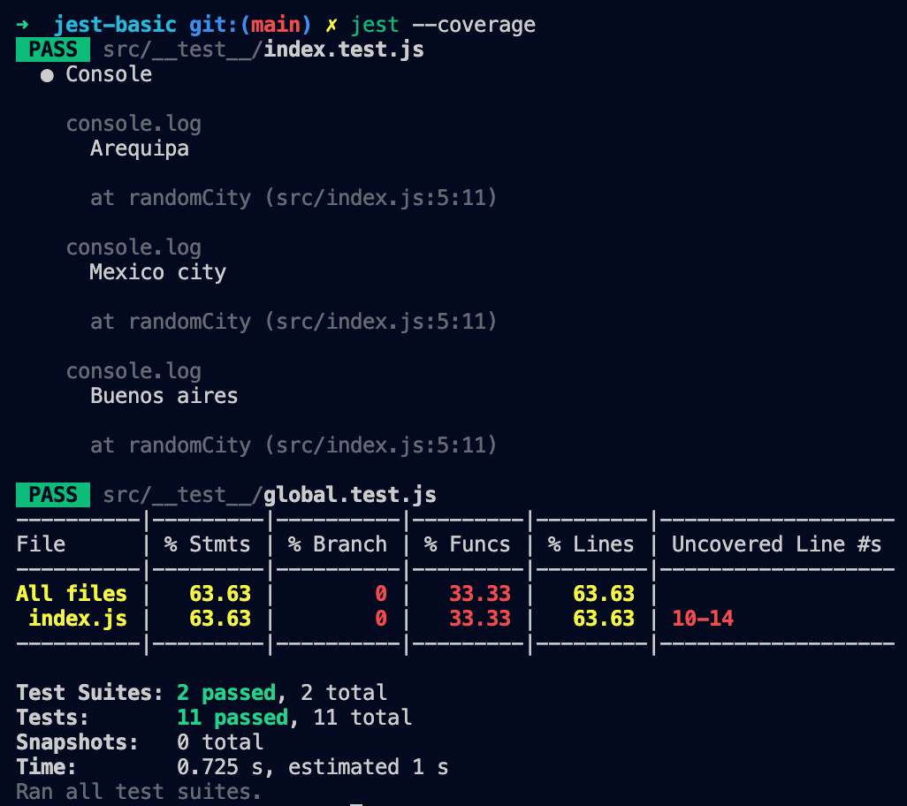
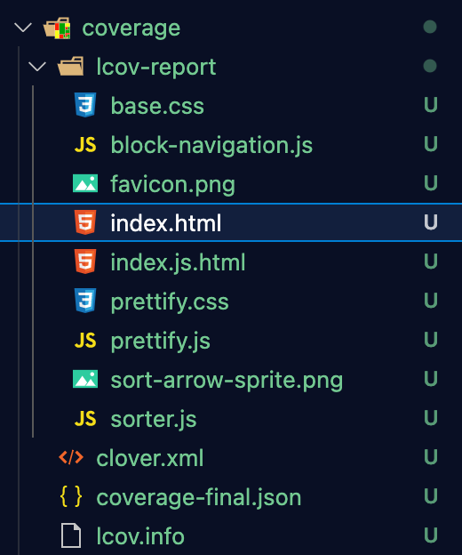

<!-- date: año-mes-día -->

- [Jest.io](https://jestjs.io)
- [A Beginner’s Guide to Jest Testing](https://alialhaddad.medium.com/a-beginners-guide-to-jest-testing-858d10198032)
- [Jest testing: Top features and how to use them](https://blog.logrocket.com/testing-with-jest-from-zero-to-hero-85ce0e9cc953/)
- [DOM Testing React Applications with Jest](https://www.codementor.io/@pkodmad/dom-testing-react-application-jest-k4ll4f8sd)
- [How to Test React Components Using Jest](https://www.sitepoint.com/test-react-components-jest/)


## Goals
- Set up a testing environment with Jest
- Implement unit tests using Jest
- Configure Watch and Coverage in your project
- Create mocks for test suites

## What is Jest?

Jest is a JavaScript testing framework built by Facebook and primarily designed for React-based applications, but is also used with:
- Babel
- JavaScript
- Node
- Angular
- Vue
- NestJS
- GraphQL

## ¿What is a test?

A test is a prove of work about some code I want to check its predictable functionality.

## ¿What types of tests exist?
- **Functional testing**
    - **Unit Testing:** They are small tests on chunks of our code ensuring that they comply with what is desired.
- **Non Functional testing**

# 1. Jest.js Introduction 

## 1.1 Preparing our work environment
1. ```git init``` to create our local repository
2. ```npm init``` to preparing our ork environment
3. ```npm install jest --save-dev``` to install Jest.js like a development dependencies
4. Inside **src** folder, we create a test folder call it **__test__** by dev community standards.
5. Inside **__test__** folder, the testing files have the next syntax name: **prove-name.test.js**


6. Next we have to go to **package.json** file and add this test script:
```js
  {
      "scripts": {
      "test": "jest"
    }
  }
```
We have two way to run our testing:
- ```npm run test```
- ```npm test```

To create a test, we use a function call **test()** that receives two parameters:
1. A string that describes the behavior to test
2. An anonymous function where we provide the behavior with a **expect function** and a **matcher function**
    - The [expect()](https://jestjs.io/docs/expect) function is used every time you want to test a value. You will rarely call expect by itself. Instead, you will use expect along with a "matcher" function to assert something about a value.
    - The [matcher()](https://jestjs.io/docs/using-matchers) function  let you test values in different ways. [ Find more Matchers](https://jestjs.io/docs/using-matchers).

Check the syntax in a simple example testing strings:
```js
let str = 'Hello sexy';

test("Input have the word: Hello", ()=>{
  expect(str).toMatch(/Hello/);
  expect(str).toMatch(/sexy/);
})
```
When the test is success we can see a image like this:


## 1.2 Some unit testing examples

```js
// =========== Str 
let str = 'Hello sexy'
test("Input have the word: Hello", ()=>{
  expect(str).toMatch(/Hello/);
  expect(str).toMatch(/sexy/);
})
// =========== Str Arrays
let fruits = ["Orange", "Apple", "Grapes"];
test("Is there fruits inside", ()=>{
  expect(fruits).toContain("Orange");
  expect(fruits).toContain("Apple");
  expect(fruits).toContain("Grapes");
})
// =========== Number
test("Input expect is greater than reference", ()=>{
  expect(10).toBeGreaterThan(9);
  expect(10).toBeGreaterThan(1);
})
// =========== Booleans
test("Is true",()=>{
  expect(true).toBeTruthy();
})
test("Is false",()=>{
  expect(false).toBeFalsy();
})
```
It's common in JavaScript for code to run asynchronously. When you have code that runs asynchronously, Jest needs to know when the code it is testing has completed, before it can move on to another test. Jest has several ways to handle this.
```js
// =========== CallBacks
let reverseStr = (str, callBack)=>{
   callBack(str.split("").reverse().join(""))
}
test("reverse string",()=>{
  reverseStr('Jorge', (str)=>{
    expect(str).toBe("egroJ")
  })
})
// =========== Promise
const reverseStr1 = (str)=>{
  return new Promise((resolve, reject)=>{
    if(!str){
      reject(Error("Error"))
    }
    resolve(str.split("").reverse().join(""))
  });
};

test("reverse str by Promise",()=>{
  return reverseStr1("ana")
    .then((str)=>{
      expect(str).toBe("ana")
    });
});
// =========== Async and Await
test("Reverse str by Async & Await", async ()=>{
  const string = await reverseStr1("ana");  
  expect(string).toBe("ana")
})
```
Useful tip testing a DataBase:
```js
// =========== Functions runs after of before to run test
// After: This Function let me run test with functions ran before the test 
afterEach(()=> console.log("After each test"));
afterAll(()=> console.log("After all test"));

// Before: 
beforeEach(()=> console.log("Before each test"));
beforeAll(()=> console.log("Before all test"));
```
## 1.3 Describe(), Watch y Coverage

### the function Describe() let us creates a block that groups together several related tests, have the next syntax describe(name, fn) and inside the fn will be each related test.

```js
describe("testing randomCity() functionality", ()=>{
  test("Return a random city from a Array", ()=>{
    expect(typeof(randomCity())).toBe("string")
  });
  test("Verify is Cali not exist", ()=>{
    expect(typeof(randomCity())).not.toMatch(/Cali/);
  });
})
```

### Watch
In our **package.json** file we can create a script to run a watcher focusing in our tests, the script look like this:
```js
"scripts": {
    "test": "jest",
    "test:watch": "jest --watch"
  },
```

When we run ```npm run test:watch``` the watcher run continuously and in the console we can see the next options:


### Coverage

The line command is: ```test --coverage``` and generate a result like this...

and a folder call **coverage**, if we want to see deeply, is only run this file in our browser: ```coverage/Icov-report/index.html```



# 2. Using Jest.js with React.js
# 3. Deploy and CI with Travis